```{r}
library(tibble)
```
# Overview
This project aims to analyze publicly available scRNAseq data by comparing 16 samples with ankylosing spondylitis to 22 healthy samples, all from blood. 2 healthy and 2 AS samples were collected by the Kuhn lab, 10 AS and 20 healthy samples were obtained from public data collected by the University of California, San Francisco (https://www.ncbi.nlm.nih.gov/geo/query/acc.cgi?acc=GSE194315), and  4 AS samples were collected from ArrayExpress (https://www.ebi.ac.uk/biostudies/arrayexpress/studies/E-MTAB-10948?query=E-MTAB-10948). Some collected samples were not blood and were dropped. A total of 16 diseased and 22 healthy samples were used for this analysis.

The samples collected by the Kuhn lab were provided as fastq files. These samples were mapped to a reference genome with starSolo to generate the count matrix, barcode, and gene list files for Seurat. All samples were integrated into a Seurat pipeline to create a Seurat object with all of the sample information. This Seurat object was used as input for the following Wilcoxon rank sum test pipeline.

An an all-vs-all comparison of differential gene expression was performed using Wilcoxon and creating volcano plots from these results. Additionally, the gene lists from Wilcoxon were used as input for Enrichr, which is a pathway analysis tool. Following this analysis, a comparison of healthy to diseased samples was performed on 5 unique cell types, Naive CD4, CD14 Monocytes, Memory CD4, CD8 T, and FCGR3A Monocytes. Cell clusters were identified using the FindMarkers function in Seurat. The barcodes for these cell types were subsetted and a Wilcoxon rank sum test was used to perform differential gene expression on these subsets. Volcano plots were generated from these results and the gene lists were used as input for Enrichr. 

# Downloading Data

This bash script was used to download samples from NCBI by taking a list of accession numbers as input. Once downloaded to my local machine, the files could be transferred to Alpine using Globus web file transfer.

```{r eval=FALSE}
#!/bin/bash

# Initialize a counter for the number of files downloaded
count=0

# Loop through the list of accession numbers
while read -r accession; do
    echo "Downloading $accession..."

    # Download the SRA file
    prefetch $accession

    # Change to the directory containing the .sra file
    if [ -d "$accession" ]; then
        cd "$accession" || { echo "Failed to change directory to $accession."; continue; }

        # Run the fastq-dump command
        fastq-dump --split-files --gzip --skip-technical --readids --read-filter pass --dumpbase --clip "${accession}.sra"

        # Check if the FASTQ files were successfully created
        if [ -f "${accession}_1.fastq.gz" ] && [ -f "${accession}_2.fastq.gz" ]; then
            echo "$accession downloaded and processed successfully."
            count=$((count + 1))
        else
            echo "Failed to generate FASTQ files for $accession."
        fi

        # Return to the parent directory
        cd ..
    else
        echo "Directory $accession not found."
    fi
done < accessions.txt

# Print the total number of files processed
echo "$count files downloaded and processed successfully."

```

# Quality Control
This script was used to perform quality control using fastp on the fastq files collected by the Kuhn lab. Fasp removes low quality reads, corrects low-quality bases and removes short reads or long poly-G tails.

```{r eval=FALSE}
# Create the output directory if it doesn't exist
mkdir -p "$output_dir"

# Loop through all the R1 fastq files in the input directory
for file1 in "$input_dir"/*_pass_1.fastq.gz; do
  # Derive the base name (without _R1.fastq.gz)
  base_name=$(basename "$file1" _pass_1.fastq.gz)

  # Corresponding R2 file
  file2="${input_dir}/${base_name}_pass_2.fastq.gz"
  # Run fastp on paired-end files

  fastp -i "$file1" -I "$file2" \
        -o "$output_dir/${base_name}_pass_1_trimmed.fastq.gz" \
        -O "$output_dir/${base_name}_pass_2_trimmed.fastq.gz"
done


```

# Indexing
This script was used for indexing the reference genome pulled from NCBI (https://www.ncbi.nlm.nih.gov/datasets/taxonomy/9606/).
```{r eval= FALSE}
#!/bin/bash
# Request resources for the job
#SBATCH --nodes=1
#SBATCH --partition=amilan
#SBATCH --qos=normal
#SBATCH --time=24:00:00
#SBATCH --mem=30G
#SBATCH --ntasks=4
#SBATCH --account=amc-general
#SBATCH --job-name=jonsson_star
#SBATCH --output=Jonsson_map%J.log
#SBATCH --error=Jonsson_map%J.err
#SBATCH --mail-user=connor.eck@cuanschutz.edu
#SBATCH --mail-type=END

#Load Star
module load star/2.7.10b 

#Run indexing command
STAR --runThreadN 4 --runMode genomeGenerate --genomeDir genome_index_output/ --genomeFastaFiles ./genome_index/genomic.fasta --sjdbGTFfile ./genome_index/genomic.gtf --sjdbOverhang 100

```
# Mapping
This script was used for mapping the fastq files collected by the Kuhn lab using starSolo. Cell barcodes are 16 bases long and unique molecular identifiers are 12 bases long.
```{r eval = FALSE}
#!/bin/bash
# Request resources for the job
#SBATCH --nodes=1
#SBATCH --partition=amilan
#SBATCH --qos=normal
#SBATCH --time=24:00:00
#SBATCH --mem=200G
#SBATCH --ntasks=10
#SBATCH --account=amc-general
#SBATCH --job-name=kuhn_starsolo
#SBATCH --output=Kuhn_solo_map%J.log
#SBATCH --error=Kuhn_solo_map%J.err
#SBATCH --mail-user=connor.eck@cuanschutz.edu
#SBATCH --mail-type=END
# Load STAR module
module load star/2.7.10b 
# Directory containing your fastq files
input_dir="/scratch/alpine/ceck@xsede.org/Kuhn_Data/Kuhn_fastp_output_Glob/"
output_dir="/scratch/alpine/ceck@xsede.org/Kuhn_Data/Glob_mapping_output_solo/"
genome_dir="/scratch/alpine/ceck@xsede.org/Kuhn_Data/genome_index_output/"
# Create the output directory if it doesn't exist
mkdir -p "$output_dir"
# Number of threads to use
threads=10
# Loop through all the R1 fastq files in the input directory
for fileR1 in "$input_dir"/*_R1_trimmed.fastq.gz ; do
  # Get the base name of the file (without the directory and _R1_trimmed.fastq.gz)
  base_name=$(basename "$fileR1" _R1_trimmed.fastq.gz)
  
  # Define the corresponding R2 file
  fileR2="$input_dir/${base_name}_R2_trimmed.fastq.gz"
  
  # Check if the corresponding R2 file exists
  if [[ ! -f "$fileR2" ]]; then
    echo "R2 file for $fileR1 not found, skipping..."
    continue
  fi

  # Run STARsolo on each pair of fastq files (R1 and R2)
  STAR --runThreadN "$threads" \
       --genomeDir "$genome_dir" \
       --limitBAMsortRAM 200000000000 \
       --readFilesIn "$fileR1" "$fileR2" \
       --readFilesCommand zcat \
       --outFileNamePrefix "$output_dir/${base_name}_" \
       --outSAMtype BAM SortedByCoordinate \
       --soloType CB_UMI_Simple \
       --soloCBstart 1 --soloCBlen 16 \
       --soloUMIstart 17 --soloUMIlen 12 \
       --soloFeatures Gene \
       --soloBarcodeMate 1 \
       --soloCBwhitelist None \
       --clip5pNbases 28 5
  
  # Check if the command was successful
  if [[ $? -eq 0 ]]; then
    echo "STARsolo successfully processed $fileR1 and $fileR2"
  else
    echo "Error processing $fileR1 and $fileR2 with STARsolo"
  fi
done

```


# Combining Samples
This script was used to combine the count matrix, barcode, and gene list files from each sample into a single Seurat object. Metadata for each sample is also added including sample ID, disease status, and batch. 
```{r eval=FALSE}

library(Seurat)
library(ggplot2)
library(Matrix)
# # Read the data and create Seurat objects for Clonal Fates # #
# AS01PB
clonal_mat_AS01PB <- readMM("/scratch/alpine/ceck@xsede.org/Kuhn_Data/Clonal_fates/E-MTAB-10948/AS01PB.matrix.mtx.gz")
features_AS01PB <- read.table("/scratch/alpine/ceck@xsede.org/Kuhn_Data/Clonal_fates/E-MTAB-10948/AS01PB.features.tsv.gz", header=FALSE, stringsAsFactors=FALSE)
barcodes_AS01PB <- read.table("/scratch/alpine/ceck@xsede.org/Kuhn_Data/Clonal_fates/E-MTAB-10948/AS01PB.barcodes.tsv.gz", header=FALSE, stringsAsFactors=FALSE)
features_AS01PB$V2 <- make.unique(features_AS01PB$V2)
rownames(clonal_mat_AS01PB) <- features_AS01PB$V2  # Gene names
colnames(clonal_mat_AS01PB) <- barcodes_AS01PB$V1  # Barcodes
AS01PB <- CreateSeuratObject(counts = clonal_mat_AS01PB, project = "Kuhn")
# Add sample identifiers, tissue type, cell type, and disease state
AS01PB$sample <- "AS01PB"
AS01PB$disease <- "ankylosing_spondylitis"
AS01PB$batch <- "clonal"
# AS01SF
clonal_mat_AS01SF <- readMM("/scratch/alpine/ceck@xsede.org/Kuhn_Data/Clonal_fates/E-MTAB-10948/AS01SF.matrix.mtx.gz")
features_AS01SF <- read.table("/scratch/alpine/ceck@xsede.org/Kuhn_Data/Clonal_fates/E-MTAB-10948/AS01SF.features.tsv.gz", header=FALSE, stringsAsFactors=FALSE)
barcodes_AS01SF <- read.table("/scratch/alpine/ceck@xsede.org/Kuhn_Data/Clonal_fates/E-MTAB-10948/AS01SF.barcodes.tsv.gz", header=FALSE, stringsAsFactors=FALSE)
features_AS01SF$V2 <- make.unique(features_AS01SF$V2)
rownames(clonal_mat_AS01SF) <- features_AS01SF$V2  # Gene names
colnames(clonal_mat_AS01SF) <- barcodes_AS01SF$V1  # Barcodes
AS01SF <- CreateSeuratObject(counts = clonal_mat_AS01SF, project = "Kuhn")
# Add sample identifiers, tissue type, cell type, and disease state
AS01SF$sample <- "AS01SF"
AS01SF$cell_type <- "mononuclear_cell"
AS01SF$tissue_type <- "synovial_fluid"
AS01SF$disease <- "ankylosing_spondylitis"
AS01SF$batch <- "clonal"
# AS02PB
clonal_mat_AS02PB <- readMM("/scratch/alpine/ceck@xsede.org/Kuhn_Data/Clonal_fates/E-MTAB-10948/AS02PB.matrix.mtx.gz")
features_AS02PB <- read.table("/scratch/alpine/ceck@xsede.org/Kuhn_Data/Clonal_fates/E-MTAB-10948/AS02PB.features.tsv.gz", header=FALSE, stringsAsFactors=FALSE)
barcodes_AS02PB <- read.table("/scratch/alpine/ceck@xsede.org/Kuhn_Data/Clonal_fates/E-MTAB-10948/AS02PB.barcodes.tsv.gz", header=FALSE, stringsAsFactors=FALSE)
features_AS02PB$V2 <- make.unique(features_AS02PB$V2)
rownames(clonal_mat_AS02PB) <- features_AS02PB$V2  # Gene names
colnames(clonal_mat_AS02PB) <- barcodes_AS02PB$V1  # Barcodes
AS02PB <- CreateSeuratObject(counts = clonal_mat_AS02PB, project = "Kuhn")
# Add sample identifiers, tissue type, cell type, and disease state
AS02PB$sample <- "AS02PB"
AS02PB$disease <- "ankylosing_spondylitis"
AS02PB$batch <- "clonal"
# AS02SF
clonal_mat_AS02SF <- readMM("/scratch/alpine/ceck@xsede.org/Kuhn_Data/Clonal_fates/E-MTAB-10948/AS02SF.matrix.mtx.gz")
features_AS02SF <- read.table("/scratch/alpine/ceck@xsede.org/Kuhn_Data/Clonal_fates/E-MTAB-10948/AS02SF.features.tsv.gz", header=FALSE, stringsAsFactors=FALSE)
barcodes_AS02SF <- read.table("/scratch/alpine/ceck@xsede.org/Kuhn_Data/Clonal_fates/E-MTAB-10948/AS02SF.barcodes.tsv.gz", header=FALSE, stringsAsFactors=FALSE)
features_AS02SF$V2 <- make.unique(features_AS02SF$V2)
rownames(clonal_mat_AS02SF) <- features_AS02SF$V2  # Gene names
colnames(clonal_mat_AS02SF) <- barcodes_AS02SF$V1  # Barcodes
AS02SF <- CreateSeuratObject(counts = clonal_mat_AS02SF, project = "Kuhn")
# Add sample identifiers, tissue type, cell type, and disease state
AS02SF$sample <- "AS02SF"
AS02SF$cell_type <- "mononuclear_cell"
AS02SF$tissue_type <- "synovial_fluid"
AS02SF$disease <- "ankylosing_spondylitis"
AS02SF$batch <- "clonal"

# #Create Seurat Objects for Kuhn Matrices # #

#K_3_21B_1_S16_L001
mat_3_21B_1_S16_L001<- readMM("/scratch/alpine/ceck@xsede.org/Kuhn_Data/Glob_mapping_output_solo/3_21B_1_S16_L001_Solo.out/Gene/filtered/matrix.mtx")
features_K_3_21B_1_S16_L001 <- read.table("/scratch/alpine/ceck@xsede.org/Kuhn_Data/Glob_mapping_output_solo/3_21B_1_S16_L001_Solo.out/Gene/filtered/features.tsv", header=FALSE, stringsAsFactors=FALSE)
barcodes_K_3_21B_1_S16_L001 <- read.table("/scratch/alpine/ceck@xsede.org/Kuhn_Data/Glob_mapping_output_solo/3_21B_1_S16_L001_Solo.out/Gene/filtered/barcodes.tsv", header=FALSE, stringsAsFactors=FALSE)
features_K_3_21B_1_S16_L001$V2 <- make.unique(features_K_3_21B_1_S16_L001$V2)
rownames(mat_3_21B_1_S16_L001) <- features_K_3_21B_1_S16_L001$V2  # Gene names
colnames(mat_3_21B_1_S16_L001) <- barcodes_K_3_21B_1_S16_L001$V1  # Barcodes
K_3_21B_1_S16_L001 <- CreateSeuratObject(counts = mat_3_21B_1_S16_L001, project = "Kuhn")
# Add sample identifiers, tissue type, cell type, and disease state
K_3_21B_1_S16_L001$sample <- "21B"
K_3_21B_1_S16_L001$disease <- "healthy"
K_3_21B_1_S16_L001$batch <- "Kuhn_collected"

#K_7_27B_1_S32_L001
mat_7_27B_1_S32_L001<- readMM("/scratch/alpine/ceck@xsede.org/Kuhn_Data/Glob_mapping_output_solo/7_27B_1_S32_L001_Solo.out/Gene/filtered/matrix.mtx")
features_K_7_27B_1_S32_L001 <- read.table("/scratch/alpine/ceck@xsede.org/Kuhn_Data/Glob_mapping_output_solo/7_27B_1_S32_L001_Solo.out/Gene/filtered/features.tsv", header=FALSE, stringsAsFactors=FALSE)
barcodes_K_7_27B_1_S32_L001 <- read.table("/scratch/alpine/ceck@xsede.org/Kuhn_Data/Glob_mapping_output_solo/7_27B_1_S32_L001_Solo.out/Gene/filtered/barcodes.tsv", header=FALSE, stringsAsFactors=FALSE)
features_K_7_27B_1_S32_L001$V2 <- make.unique(features_K_7_27B_1_S32_L001$V2)
rownames(mat_7_27B_1_S32_L001) <- features_K_7_27B_1_S32_L001$V2  # Gene names
colnames(mat_7_27B_1_S32_L001) <- barcodes_K_7_27B_1_S32_L001$V1  # Barcodes
K_7_27B_1_S32_L001 <- CreateSeuratObject(counts = mat_7_27B_1_S32_L001, project = "Kuhn")
# Add sample identifiers, tissue type, cell type, and disease state
K_7_27B_1_S32_L001$sample <- "27B"
K_7_27B_1_S32_L001$disease <- "Spondyloarthritis"
K_7_27B_1_S32_L001$batch <- "Kuhn_collected"


# # Read the data and create Seurat objects for Epitope Paper # #

#PBMC_01_3
PBMC_01_3_mat <- readMM("/scratch/alpine/ceck@xsede.org/Kuhn_Data/Epitope_Count/GSE194315_PBMC-01-07_processed_data_files/PBMC-01-3.matrix.mtx.gz")
PBMC_01_3_features <- read.table("/scratch/alpine/ceck@xsede.org/Kuhn_Data/Epitope_Count/GSE194315_PBMC-01-07_processed_data_files/PBMC-01-3.features.tsv.gz", header=FALSE, stringsAsFactors=FALSE)
PBMC_01_3_barcodes <- read.table("/scratch/alpine/ceck@xsede.org/Kuhn_Data/Epitope_Count/GSE194315_PBMC-01-07_processed_data_files/PBMC-01-3.barcodes.tsv.gz", header=FALSE, stringsAsFactors=FALSE)
PBMC_01_3_features$V2 <- make.unique(PBMC_01_3_features$V2)
rownames(PBMC_01_3_mat) <- PBMC_01_3_features$V2  # Gene names
colnames(PBMC_01_3_mat) <- PBMC_01_3_barcodes$V1  # Barcodes
PBMC_01_3 <- CreateSeuratObject(counts = PBMC_01_3_mat, project = "Kuhn")
PBMC_01_3$sample <- "PBMC_01_3_Healthy"
PBMC_01_3$disease <- "healthy"
PBMC_01_3$batch <- "epitope"
#PBMC_01_4
PBMC_01_4_mat <- readMM("/scratch/alpine/ceck@xsede.org/Kuhn_Data/Epitope_Count/GSE194315_PBMC-01-07_processed_data_files/PBMC-01-4.matrix.mtx.gz")
PBMC_01_4_features <- read.table("/scratch/alpine/ceck@xsede.org/Kuhn_Data/Epitope_Count/GSE194315_PBMC-01-07_processed_data_files/PBMC-01-4.features.tsv.gz", header=FALSE, stringsAsFactors=FALSE)
PBMC_01_4_barcodes <- read.table("/scratch/alpine/ceck@xsede.org/Kuhn_Data/Epitope_Count/GSE194315_PBMC-01-07_processed_data_files/PBMC-01-4.barcodes.tsv.gz", header=FALSE, stringsAsFactors=FALSE)
PBMC_01_4_features$V2 <- make.unique(PBMC_01_4_features$V2)
rownames(PBMC_01_4_mat) <- PBMC_01_4_features$V2  # Gene names
colnames(PBMC_01_4_mat) <- PBMC_01_4_barcodes$V1  # Barcodes
PBMC_01_4 <- CreateSeuratObject(counts = PBMC_01_4_mat, project = "Kuhn")
PBMC_01_4$sample <- "PBMC_01_4_Healthy"
PBMC_01_4$disease <- "healthy"
PBMC_01_4$batch <- "epitope"
#PBMC_02_1
PBMC_02_1_mat <- readMM("/scratch/alpine/ceck@xsede.org/Kuhn_Data/Epitope_Count/GSE194315_PBMC-01-07_processed_data_files/PBMC-02-1.matrix.mtx.gz")
PBMC_02_1_features <- read.table("/scratch/alpine/ceck@xsede.org/Kuhn_Data/Epitope_Count/GSE194315_PBMC-01-07_processed_data_files/PBMC-02-1.features.tsv.gz", header=FALSE, stringsAsFactors=FALSE)
PBMC_02_1_barcodes <- read.table("/scratch/alpine/ceck@xsede.org/Kuhn_Data/Epitope_Count/GSE194315_PBMC-01-07_processed_data_files/PBMC-02-1.barcodes.tsv.gz", header=FALSE, stringsAsFactors=FALSE)
# Ensure unique feature names
PBMC_02_1_features$V2 <- make.unique(PBMC_02_1_features$V2)
# Assign row and column names to the matrix
rownames(PBMC_02_1_mat) <- PBMC_02_1_features$V2  # Gene names (features)
colnames(PBMC_02_1_mat) <- PBMC_02_1_barcodes$V1  # Barcodes (cells)
# Create the Seurat object
PBMC_02_1 <- CreateSeuratObject(counts = PBMC_02_1_mat, project = "Kuhn")

#Create AXI Object
PBMC_02_1_barcodes_AXI <- read.csv("PBMC_02_1_bar.csv", header = FALSE, stringsAsFactors = FALSE)$V1
PBMC_02_1_AXI <- subset(PBMC_02_1, cells = PBMC_02_1_barcodes_AXI)
PBMC_02_1_AXI$sample <- "PBMC_02_1_AXI"
PBMC_02_1_AXI$disease <- "AXI"
PBMC_02_1_AXI$batch <- "epitope"
# Create Healthy Object
PBMC_02_1_barcodes_healthy <- read.csv("PBMC_02_1_bar_Heal.csv", header = FALSE, stringsAsFactors = FALSE)$V1
PBMC_02_1_healthy <- subset(PBMC_02_1, cells = PBMC_02_1_barcodes_healthy)
PBMC_02_1_healthy$sample <- "PBMC_02_1_Healthy"
PBMC_02_1_healthy$disease <- "healthy"
PBMC_02_1_healthy$batch <- "epitope"

#PBMC_02_2
PBMC_02_2_mat <- readMM("/scratch/alpine/ceck@xsede.org/Kuhn_Data/Epitope_Count/GSE194315_PBMC-01-07_processed_data_files/PBMC-02-2.matrix.mtx.gz")
PBMC_02_2_features <- read.table("/scratch/alpine/ceck@xsede.org/Kuhn_Data/Epitope_Count/GSE194315_PBMC-01-07_processed_data_files/PBMC-02-2.features.tsv.gz", header=FALSE, stringsAsFactors=FALSE)
PBMC_02_2_barcodes <- read.table("/scratch/alpine/ceck@xsede.org/Kuhn_Data/Epitope_Count/GSE194315_PBMC-01-07_processed_data_files/PBMC-02-2.barcodes.tsv.gz", header=FALSE, stringsAsFactors=FALSE)
# Ensure unique feature names
PBMC_02_2_features$V2 <- make.unique(PBMC_02_2_features$V2)
# Assign row and column names to the matrix
rownames(PBMC_02_2_mat) <- PBMC_02_2_features$V2  # Gene names (features)
colnames(PBMC_02_2_mat) <- PBMC_02_2_barcodes$V1  # Barcodes (cells)
# Create the Seurat object
PBMC_02_2 <- CreateSeuratObject(counts = PBMC_02_2_mat, project = "Kuhn")

#Create AXI Object
PBMC_02_2_barcodes_AXI <- read.csv("PBMC_02_2_bar.csv", header = FALSE, stringsAsFactors = FALSE)$V1
PBMC_02_2_AXI <- subset(PBMC_02_2, cells = PBMC_02_2_barcodes_AXI)
PBMC_02_2_AXI$sample <- "PBMC_02_2_AXI"
PBMC_02_2_AXI$disease <- "AXI"
PBMC_02_2_AXI$batch <- "epitope"
# Create Healthy Object
PBMC_02_2_barcodes_healthy <- read.csv("PBMC_02_2_bar_Heal.csv", header = FALSE, stringsAsFactors = FALSE)$V1
PBMC_02_2_healthy <- subset(PBMC_02_2, cells = PBMC_02_2_barcodes_healthy)
PBMC_02_2_healthy$sample <- "PBMC_02_2_Healthy"
PBMC_02_2_healthy$disease <- "healthy"
PBMC_02_2_healthy$batch <- "epitope"


#PBMC_02_3
PBMC_02_3_mat <- readMM("/scratch/alpine/ceck@xsede.org/Kuhn_Data/Epitope_Count/GSE194315_PBMC-01-07_processed_data_files/PBMC-02-3.matrix.mtx.gz")
PBMC_02_3_features <- read.table("/scratch/alpine/ceck@xsede.org/Kuhn_Data/Epitope_Count/GSE194315_PBMC-01-07_processed_data_files/PBMC-02-3.features.tsv.gz", header=FALSE, stringsAsFactors=FALSE)
PBMC_02_3_barcodes <- read.table("/scratch/alpine/ceck@xsede.org/Kuhn_Data/Epitope_Count/GSE194315_PBMC-01-07_processed_data_files/PBMC-02-3.barcodes.tsv.gz", header=FALSE, stringsAsFactors=FALSE)
# Ensure unique feature names
PBMC_02_3_features$V2 <- make.unique(PBMC_02_3_features$V2)
# Assign row and column names to the matrix
rownames(PBMC_02_3_mat) <- PBMC_02_3_features$V2  # Gene names (features)
colnames(PBMC_02_3_mat) <- PBMC_02_3_barcodes$V1  # Barcodes (cells)
# Create the Seurat object
PBMC_02_3 <- CreateSeuratObject(counts = PBMC_02_3_mat, project = "Kuhn")

#Create AXI Object
PBMC_02_3_barcodes_AXI <- read.csv("PBMC_02_3_bar.csv", header = FALSE, stringsAsFactors = FALSE)$V1
PBMC_02_3_AXI <- subset(PBMC_02_3, cells = PBMC_02_3_barcodes_AXI)
PBMC_02_3_AXI$sample <- "PBMC_02_3_AXI"
PBMC_02_3_AXI$disease <- "AXI"
PBMC_02_3_AXI$batch <- "epitope"
# Create Healthy Object
PBMC_02_3_barcodes_healthy <- read.csv("PBMC_02_3_bar_Heal.csv", header = FALSE, stringsAsFactors = FALSE)$V1
PBMC_02_3_healthy <- subset(PBMC_02_3, cells = PBMC_02_3_barcodes_healthy)
PBMC_02_3_healthy$sample <- "PBMC_02_3_Healthy"
PBMC_02_3_healthy$disease <- "healthy"
PBMC_02_3_healthy$batch <- "epitope"


#PBMC_02_4
PBMC_02_4_mat <- readMM("/scratch/alpine/ceck@xsede.org/Kuhn_Data/Epitope_Count/GSE194315_PBMC-01-07_processed_data_files/PBMC-02-4.matrix.mtx.gz")
PBMC_02_4_features <- read.table("/scratch/alpine/ceck@xsede.org/Kuhn_Data/Epitope_Count/GSE194315_PBMC-01-07_processed_data_files/PBMC-02-4.features.tsv.gz", header=FALSE, stringsAsFactors=FALSE)
PBMC_02_4_barcodes <- read.table("/scratch/alpine/ceck@xsede.org/Kuhn_Data/Epitope_Count/GSE194315_PBMC-01-07_processed_data_files/PBMC-02-4.barcodes.tsv.gz", header=FALSE, stringsAsFactors=FALSE)
# Ensure unique feature names
PBMC_02_4_features$V2 <- make.unique(PBMC_02_4_features$V2)
# Assign row and column names to the matrix
rownames(PBMC_02_4_mat) <- PBMC_02_4_features$V2  # Gene names (features)
colnames(PBMC_02_4_mat) <- PBMC_02_4_barcodes$V1  # Barcodes (cells)
# Create the Seurat object
PBMC_02_4 <- CreateSeuratObject(counts = PBMC_02_4_mat, project = "Kuhn")

#Create AXI Object
PBMC_02_4_barcodes_AXI <- read.csv("PBMC_02_4_bar.csv", header = FALSE, stringsAsFactors = FALSE)$V1
PBMC_02_4_AXI <- subset(PBMC_02_4, cells = PBMC_02_4_barcodes_AXI)
PBMC_02_4_AXI$sample <- "PBMC_02_4_AXI"
PBMC_02_4_AXI$disease <- "AXI"
PBMC_02_4_AXI$batch <- "epitope"
# Create Healthy Object
PBMC_02_4_barcodes_healthy <- read.csv("PBMC_02_4_bar_Heal.csv", header = FALSE, stringsAsFactors = FALSE)$V1
PBMC_02_4_healthy <- subset(PBMC_02_4, cells = PBMC_02_4_barcodes_healthy)
PBMC_02_4_healthy$sample <- "PBMC_02_4_Healthy"
PBMC_02_4_healthy$disease <- "healthy"
PBMC_02_4_healthy$batch <- "epitope"


#PBMC_03_1
PBMC_03_1_mat <- readMM("/scratch/alpine/ceck@xsede.org/Kuhn_Data/Epitope_Count/GSE194315_PBMC-01-07_processed_data_files/PBMC-03-1.matrix.mtx.gz")
PBMC_03_1_features <- read.table("/scratch/alpine/ceck@xsede.org/Kuhn_Data/Epitope_Count/GSE194315_PBMC-01-07_processed_data_files/PBMC-03-1.features.tsv.gz", header=FALSE, stringsAsFactors=FALSE)
PBMC_03_1_barcodes <- read.table("/scratch/alpine/ceck@xsede.org/Kuhn_Data/Epitope_Count/GSE194315_PBMC-01-07_processed_data_files/PBMC-03-1.barcodes.tsv.gz", header=FALSE, stringsAsFactors=FALSE)
# Ensure unique feature names
PBMC_03_1_features$V2 <- make.unique(PBMC_03_1_features$V2)
# Assign row and column names to the matrix
rownames(PBMC_03_1_mat) <- PBMC_03_1_features$V2  # Gene names (features)
colnames(PBMC_03_1_mat) <- PBMC_03_1_barcodes$V1  # Barcodes (cells)
# Create the Seurat object
PBMC_03_1 <- CreateSeuratObject(counts = PBMC_03_1_mat, project = "Kuhn")

#Create AXI Object
PBMC_03_1_barcodes_AXI <- read.csv("PBMC_03_1_bar.csv", header = FALSE, stringsAsFactors = FALSE)$V1
PBMC_03_1_AXI <- subset(PBMC_03_1, cells = PBMC_03_1_barcodes_AXI)
PBMC_03_1_AXI$sample <- "PBMC_03_1_AXI"
PBMC_03_1_AXI$disease <- "AXI"
PBMC_03_1_AXI$batch <- "epitope"
# Create Healthy Object
PBMC_03_1_barcodes_healthy <- read.csv("PBMC_03_1_bar_Heal.csv", header = FALSE, stringsAsFactors = FALSE)$V1
PBMC_03_1_healthy <- subset(PBMC_03_1, cells = PBMC_03_1_barcodes_healthy)
PBMC_03_1_healthy$sample <- "PBMC_03_1_Healthy"
PBMC_03_1_healthy$disease <- "healthy"
PBMC_03_1_healthy$batch <- "epitope"


#PBMC_03_2
PBMC_03_2_mat <- readMM("/scratch/alpine/ceck@xsede.org/Kuhn_Data/Epitope_Count/GSE194315_PBMC-01-07_processed_data_files/PBMC-03-2.matrix.mtx.gz")
PBMC_03_2_features <- read.table("/scratch/alpine/ceck@xsede.org/Kuhn_Data/Epitope_Count/GSE194315_PBMC-01-07_processed_data_files/PBMC-03-2.features.tsv.gz", header=FALSE, stringsAsFactors=FALSE)
PBMC_03_2_barcodes <- read.table("/scratch/alpine/ceck@xsede.org/Kuhn_Data/Epitope_Count/GSE194315_PBMC-01-07_processed_data_files/PBMC-03-2.barcodes.tsv.gz", header=FALSE, stringsAsFactors=FALSE)
# Ensure unique feature names
PBMC_03_2_features$V2 <- make.unique(PBMC_03_2_features$V2)
# Assign row and column names to the matrix
rownames(PBMC_03_2_mat) <- PBMC_03_2_features$V2  # Gene names (features)
colnames(PBMC_03_2_mat) <- PBMC_03_2_barcodes$V1  # Barcodes (cells)
# Create the Seurat object
PBMC_03_2 <- CreateSeuratObject(counts = PBMC_03_2_mat, project = "Kuhn")

#Create AXI Object
PBMC_03_2_barcodes_AXI <- read.csv("PBMC_03_2_bar.csv", header = FALSE, stringsAsFactors = FALSE)$V1
PBMC_03_2_AXI <- subset(PBMC_03_2, cells = PBMC_03_2_barcodes_AXI)
PBMC_03_2_AXI$sample <- "PBMC_03_2_AXI"
PBMC_03_2_AXI$disease <- "AXI"
PBMC_03_2_AXI$batch <- "epitope"
# Create Healthy Object
PBMC_03_2_barcodes_healthy <- read.csv("PBMC_03_2_bar_Heal.csv", header = FALSE, stringsAsFactors = FALSE)$V1
PBMC_03_2_healthy <- subset(PBMC_03_2, cells = PBMC_03_2_barcodes_healthy)
PBMC_03_2_healthy$sample <- "PBMC_03_2_Healthy"
PBMC_03_2_healthy$disease <- "healthy"
PBMC_03_2_healthy$batch <- "epitope"


#PBMC_03_3
PBMC_03_3_mat <- readMM("/scratch/alpine/ceck@xsede.org/Kuhn_Data/Epitope_Count/GSE194315_PBMC-01-07_processed_data_files/PBMC-03-3.matrix.mtx.gz")
PBMC_03_3_features <- read.table("/scratch/alpine/ceck@xsede.org/Kuhn_Data/Epitope_Count/GSE194315_PBMC-01-07_processed_data_files/PBMC-03-3.features.tsv.gz", header=FALSE, stringsAsFactors=FALSE)
PBMC_03_3_barcodes <- read.table("/scratch/alpine/ceck@xsede.org/Kuhn_Data/Epitope_Count/GSE194315_PBMC-01-07_processed_data_files/PBMC-03-3.barcodes.tsv.gz", header=FALSE, stringsAsFactors=FALSE)
# Ensure unique feature names
PBMC_03_3_features$V2 <- make.unique(PBMC_03_3_features$V2)
# Assign row and column names to the matrix
rownames(PBMC_03_3_mat) <- PBMC_03_3_features$V2  # Gene names (features)
colnames(PBMC_03_3_mat) <- PBMC_03_3_barcodes$V1  # Barcodes (cells)
# Create the Seurat object
PBMC_03_3 <- CreateSeuratObject(counts = PBMC_03_3_mat, project = "Kuhn")

#Create AXI Object
PBMC_03_3_barcodes_AXI <- read.csv("PBMC_03_3_bar.csv", header = FALSE, stringsAsFactors = FALSE)$V1
PBMC_03_3_AXI <- subset(PBMC_03_3, cells = PBMC_03_3_barcodes_AXI)
PBMC_03_3_AXI$sample <- "PBMC_03_3_AXI"
PBMC_03_3_AXI$disease <- "AXI"
PBMC_03_3_AXI$batch <- "epitope"
# Create Healthy Object
PBMC_03_3_barcodes_healthy <- read.csv("PBMC_03_3_bar_Heal.csv", header = FALSE, stringsAsFactors = FALSE)$V1
PBMC_03_3_healthy <- subset(PBMC_03_3, cells = PBMC_03_3_barcodes_healthy)
PBMC_03_3_healthy$sample <- "PBMC_03_3_Healthy"
PBMC_03_3_healthy$disease <- "healthy"
PBMC_03_3_healthy$batch <- "epitope"


#PBMC_03_4
PBMC_03_4_mat <- readMM("/scratch/alpine/ceck@xsede.org/Kuhn_Data/Epitope_Count/GSE194315_PBMC-01-07_processed_data_files/PBMC-03-4.matrix.mtx.gz")
PBMC_03_4_features <- read.table("/scratch/alpine/ceck@xsede.org/Kuhn_Data/Epitope_Count/GSE194315_PBMC-01-07_processed_data_files/PBMC-03-4.features.tsv.gz", header=FALSE, stringsAsFactors=FALSE)
PBMC_03_4_barcodes <- read.table("/scratch/alpine/ceck@xsede.org/Kuhn_Data/Epitope_Count/GSE194315_PBMC-01-07_processed_data_files/PBMC-03-4.barcodes.tsv.gz", header=FALSE, stringsAsFactors=FALSE)
# Ensure unique feature names
PBMC_03_4_features$V2 <- make.unique(PBMC_03_4_features$V2)
# Assign row and column names to the matrix
rownames(PBMC_03_4_mat) <- PBMC_03_4_features$V2  # Gene names (features)
colnames(PBMC_03_4_mat) <- PBMC_03_4_barcodes$V1  # Barcodes (cells)
# Create the Seurat object
PBMC_03_4 <- CreateSeuratObject(counts = PBMC_03_4_mat, project = "Kuhn")

#Create AXI Object
PBMC_03_4_barcodes_AXI <- read.csv("PBMC_03_4_bar.csv", header = FALSE, stringsAsFactors = FALSE)$V1
PBMC_03_4_AXI <- subset(PBMC_03_4, cells = PBMC_03_4_barcodes_AXI)
PBMC_03_4_AXI$sample <- "PBMC_03_4_AXI"
PBMC_03_4_AXI$disease <- "AXI"
PBMC_03_4_AXI$batch <- "epitope"
# Create Healthy Object
PBMC_03_4_barcodes_healthy <- read.csv("PBMC_03_4_bar_Heal.csv", header = FALSE, stringsAsFactors = FALSE)$V1
PBMC_03_4_healthy <- subset(PBMC_03_4, cells = PBMC_03_4_barcodes_healthy)
PBMC_03_4_healthy$sample <- "PBMC_03_4_Healthy"
PBMC_03_4_healthy$disease <- "healthy"
PBMC_03_4_healthy$batch <- "epitope"

#PBMC_04_1
PBMC_04_1_mat <- readMM("/scratch/alpine/ceck@xsede.org/Kuhn_Data/Epitope_Count/GSE194315_PBMC-01-07_processed_data_files/PBMC-04-1.matrix.mtx.gz")
PBMC_04_1_features <- read.table("/scratch/alpine/ceck@xsede.org/Kuhn_Data/Epitope_Count/GSE194315_PBMC-01-07_processed_data_files/PBMC-04-1.features.tsv.gz", header=FALSE, stringsAsFactors=FALSE)
PBMC_04_1_barcodes <- read.table("/scratch/alpine/ceck@xsede.org/Kuhn_Data/Epitope_Count/GSE194315_PBMC-01-07_processed_data_files/PBMC-04-1.barcodes.tsv.gz", header=FALSE, stringsAsFactors=FALSE)
PBMC_04_1_features$V2 <- make.unique(PBMC_04_1_features$V2)
rownames(PBMC_04_1_mat) <- PBMC_04_1_features$V2  # Gene names
colnames(PBMC_04_1_mat) <- PBMC_04_1_barcodes$V1  # Barcodes
PBMC_04_1 <- CreateSeuratObject(counts = PBMC_04_1_mat, project = "Kuhn")
#Create AXI Object
PBMC_04_1_barcodes_AXI <- read.csv("PBMC_04_1_bar.csv", header = FALSE, stringsAsFactors = FALSE)$V1
PBMC_04_1_AXI <- subset(PBMC_04_1, cells = PBMC_04_1_barcodes_AXI)
PBMC_04_1_AXI$sample <- "PBMC_04_1_AXI"
PBMC_04_1_AXI$disease <- "AXI"
PBMC_04_1_AXI$batch <- "epitope"
# Create Healthy Object
PBMC_04_1_barcodes_healthy <- read.csv("PBMC_04_1_bar_Heal.csv", header = FALSE, stringsAsFactors = FALSE)$V1
PBMC_04_1_healthy <- subset(PBMC_04_1, cells = PBMC_04_1_barcodes_healthy)
PBMC_04_1_healthy$sample <- "PBMC_04_1_Healthy"
PBMC_04_1_healthy$disease <- "healthy"
PBMC_04_1_healthy$batch <- "epitope"

#PBMC_04_2
PBMC_04_2_mat <- readMM("/scratch/alpine/ceck@xsede.org/Kuhn_Data/Epitope_Count/GSE194315_PBMC-01-07_processed_data_files/PBMC-04-2.matrix.mtx.gz")
PBMC_04_2_features <- read.table("/scratch/alpine/ceck@xsede.org/Kuhn_Data/Epitope_Count/GSE194315_PBMC-01-07_processed_data_files/PBMC-04-2.features.tsv.gz", header=FALSE, stringsAsFactors=FALSE)
PBMC_04_2_barcodes <- read.table("/scratch/alpine/ceck@xsede.org/Kuhn_Data/Epitope_Count/GSE194315_PBMC-01-07_processed_data_files/PBMC-04-2.barcodes.tsv.gz", header=FALSE, stringsAsFactors=FALSE)
PBMC_04_2_features$V2 <- make.unique(PBMC_04_2_features$V2)
rownames(PBMC_04_2_mat) <- PBMC_04_2_features$V2  # Gene names
colnames(PBMC_04_2_mat) <- PBMC_04_2_barcodes$V1  # Barcodes
PBMC_04_2 <- CreateSeuratObject(counts = PBMC_04_2_mat, project = "Kuhn")
#Create AXI Object
PBMC_04_2_barcodes_AXI <- read.csv("PBMC_04_2_bar.csv", header = FALSE, stringsAsFactors = FALSE)$V1
PBMC_04_2_AXI <- subset(PBMC_04_2, cells = PBMC_04_2_barcodes_AXI)
PBMC_04_2_AXI$sample <- "PBMC_04_2_AXI"
PBMC_04_2_AXI$disease <- "AXI"
PBMC_04_2_AXI$batch <- "epitope"
# Create Healthy Object
PBMC_04_2_barcodes_healthy <- read.csv("PBMC_04_2_bar_Heal.csv", header = FALSE, stringsAsFactors = FALSE)$V1
PBMC_04_2_healthy <- subset(PBMC_04_2, cells = PBMC_04_2_barcodes_healthy)
PBMC_04_2_healthy$sample <- "PBMC_04_2_Healthy"
PBMC_04_2_healthy$disease <- "healthy"
PBMC_04_2_healthy$batch <- "epitope"

#PBMC_04_3
PBMC_04_3_mat <- readMM("/scratch/alpine/ceck@xsede.org/Kuhn_Data/Epitope_Count/GSE194315_PBMC-01-07_processed_data_files/PBMC-04-3.matrix.mtx.gz")
PBMC_04_3_features <- read.table("/scratch/alpine/ceck@xsede.org/Kuhn_Data/Epitope_Count/GSE194315_PBMC-01-07_processed_data_files/PBMC-04-3.features.tsv.gz", header=FALSE, stringsAsFactors=FALSE)
PBMC_04_3_barcodes <- read.table("/scratch/alpine/ceck@xsede.org/Kuhn_Data/Epitope_Count/GSE194315_PBMC-01-07_processed_data_files/PBMC-04-3.barcodes.tsv.gz", header=FALSE, stringsAsFactors=FALSE)
PBMC_04_3_features$V2 <- make.unique(PBMC_04_3_features$V2)
rownames(PBMC_04_3_mat) <- PBMC_04_3_features$V2  # Gene names
colnames(PBMC_04_3_mat) <- PBMC_04_3_barcodes$V1  # Barcodes
PBMC_04_3 <- CreateSeuratObject(counts = PBMC_04_3_mat, project = "Kuhn")
#Create AXI Object
PBMC_04_3_barcodes_AXI <- read.csv("PBMC_04_3_bar.csv", header = FALSE, stringsAsFactors = FALSE)$V1
PBMC_04_3_AXI <- subset(PBMC_04_3, cells = PBMC_04_3_barcodes_AXI)
PBMC_04_3_AXI$sample <- "PBMC_04_3_AXI"
PBMC_04_3_AXI$disease <- "AXI"
PBMC_04_3_AXI$batch <- "epitope"
# Create Healthy Object
PBMC_04_3_barcodes_healthy <- read.csv("PBMC_04_3_bar_Heal.csv", header = FALSE, stringsAsFactors = FALSE)$V1
PBMC_04_3_healthy <- subset(PBMC_04_3, cells = PBMC_04_3_barcodes_healthy)
PBMC_04_3_healthy$sample <- "PBMC_04_3_Healthy"
PBMC_04_3_healthy$disease <- "healthy"
PBMC_04_3_healthy$batch <- "epitope"

#PBMC_04_4
PBMC_04_4_mat <- readMM("/scratch/alpine/ceck@xsede.org/Kuhn_Data/Epitope_Count/GSE194315_PBMC-01-07_processed_data_files/PBMC-04-4.matrix.mtx.gz")
PBMC_04_4_features <- read.table("/scratch/alpine/ceck@xsede.org/Kuhn_Data/Epitope_Count/GSE194315_PBMC-01-07_processed_data_files/PBMC-04-4.features.tsv.gz", header=FALSE, stringsAsFactors=FALSE)
PBMC_04_4_barcodes <- read.table("/scratch/alpine/ceck@xsede.org/Kuhn_Data/Epitope_Count/GSE194315_PBMC-01-07_processed_data_files/PBMC-04-4.barcodes.tsv.gz", header=FALSE, stringsAsFactors=FALSE)
PBMC_04_4_features$V2 <- make.unique(PBMC_04_4_features$V2)
rownames(PBMC_04_4_mat) <- PBMC_04_4_features$V2  # Gene names
colnames(PBMC_04_4_mat) <- PBMC_04_4_barcodes$V1  # Barcodes
PBMC_04_4 <- CreateSeuratObject(counts = PBMC_04_4_mat, project = "Kuhn")
#Create AXI Object
PBMC_04_4_barcodes_AXI <- read.csv("PBMC_04_4_bar.csv", header = FALSE, stringsAsFactors = FALSE)$V1
PBMC_04_4_AXI <- subset(PBMC_04_4, cells = PBMC_04_4_barcodes_AXI)
PBMC_04_4_AXI$sample <- "PBMC_04_4_AXI"
PBMC_04_4_AXI$disease <- "AXI"
PBMC_04_4_AXI$batch <- "epitope"
# Create Healthy Object
PBMC_04_4_barcodes_healthy <- read.csv("PBMC_04_4_bar_Heal.csv", header = FALSE, stringsAsFactors = FALSE)$V1
PBMC_04_4_healthy <- subset(PBMC_04_4, cells = PBMC_04_4_barcodes_healthy)
PBMC_04_4_healthy$sample <- "PBMC_04_4_Healthy"
PBMC_04_4_healthy$disease <- "healthy"
PBMC_04_4_healthy$batch <- "epitope"

#PBMC_05_1
PBMC_05_1_mat <- readMM("/scratch/alpine/ceck@xsede.org/Kuhn_Data/Epitope_Count/GSE194315_PBMC-01-07_processed_data_files/PBMC-05-1.matrix.mtx.gz")
PBMC_05_1_features <- read.table("/scratch/alpine/ceck@xsede.org/Kuhn_Data/Epitope_Count/GSE194315_PBMC-01-07_processed_data_files/PBMC-05-1.features.tsv.gz", header=FALSE, stringsAsFactors=FALSE)
PBMC_05_1_barcodes <- read.table("/scratch/alpine/ceck@xsede.org/Kuhn_Data/Epitope_Count/GSE194315_PBMC-01-07_processed_data_files/PBMC-05-1.barcodes.tsv.gz", header=FALSE, stringsAsFactors=FALSE)
PBMC_05_1_features$V2 <- make.unique(PBMC_05_1_features$V2)
rownames(PBMC_05_1_mat) <- PBMC_05_1_features$V2  # Gene names
colnames(PBMC_05_1_mat) <- PBMC_05_1_barcodes$V1  # Barcodes
PBMC_05_1 <- CreateSeuratObject(counts = PBMC_05_1_mat, project = "Kuhn")
#Create AXI Object
PBMC_05_1_barcodes_AXI <- read.csv("PBMC_05_1_bar.csv", header = FALSE, stringsAsFactors = FALSE)$V1
PBMC_05_1_AXI <- subset(PBMC_05_1, cells = PBMC_05_1_barcodes_AXI)
PBMC_05_1_AXI$sample <- "PBMC_05_1_AXI"
PBMC_05_1_AXI$disease <- "AXI"
PBMC_05_1_AXI$batch <- "epitope"
# Create Healthy Object
PBMC_05_1_barcodes_healthy <- read.csv("PBMC_05_1_bar_Heal.csv", header = FALSE, stringsAsFactors = FALSE)$V1
PBMC_05_1_healthy <- subset(PBMC_05_1, cells = PBMC_05_1_barcodes_healthy)
PBMC_05_1_healthy$sample<- "PBMC_05_1_Healthy"
PBMC_05_1_healthy$disease <- "healthy"
PBMC_05_1_healthy$batch <- "epitope"

#PBMC_05_2
PBMC_05_2_mat <- readMM("/scratch/alpine/ceck@xsede.org/Kuhn_Data/Epitope_Count/GSE194315_PBMC-01-07_processed_data_files/PBMC-05-2.matrix.mtx.gz")
PBMC_05_2_features <- read.table("/scratch/alpine/ceck@xsede.org/Kuhn_Data/Epitope_Count/GSE194315_PBMC-01-07_processed_data_files/PBMC-05-2.features.tsv.gz", header=FALSE, stringsAsFactors=FALSE)
PBMC_05_2_barcodes <- read.table("/scratch/alpine/ceck@xsede.org/Kuhn_Data/Epitope_Count/GSE194315_PBMC-01-07_processed_data_files/PBMC-05-2.barcodes.tsv.gz", header=FALSE, stringsAsFactors=FALSE)
PBMC_05_2_features$V2 <- make.unique(PBMC_05_2_features$V2)
rownames(PBMC_05_2_mat) <- PBMC_05_2_features$V2  # Gene names
colnames(PBMC_05_2_mat) <- PBMC_05_2_barcodes$V1  # Barcodes
PBMC_05_2 <- CreateSeuratObject(counts = PBMC_05_2_mat, project = "Kuhn")
#Create AXI Object
PBMC_05_2_barcodes_AXI <- read.csv("PBMC_05_2_bar.csv", header = FALSE, stringsAsFactors = FALSE)$V1
PBMC_05_2_AXI <- subset(PBMC_05_2, cells = PBMC_05_2_barcodes_AXI)
PBMC_05_2_AXI$sample <- "PBMC_05_2_AXI"
PBMC_05_2_AXI$disease <- "AXI"
PBMC_05_2_AXI$batch <- "epitope"
# Create Healthy Object
PBMC_05_2_barcodes_healthy <- read.csv("PBMC_05_2_bar_Heal.csv", header = FALSE, stringsAsFactors = FALSE)$V1
PBMC_05_2_healthy <- subset(PBMC_05_2, cells = PBMC_05_2_barcodes_healthy)
PBMC_05_2_healthy$sample <- "PBMC_05_2_Healthy"
PBMC_05_2_healthy$disease <- "healthy"
PBMC_05_2_healthy$batch <- "epitope"

#PBMC_05_3
PBMC_05_3_mat <- readMM("/scratch/alpine/ceck@xsede.org/Kuhn_Data/Epitope_Count/GSE194315_PBMC-01-07_processed_data_files/PBMC-05-3.matrix.mtx.gz")
PBMC_05_3_features <- read.table("/scratch/alpine/ceck@xsede.org/Kuhn_Data/Epitope_Count/GSE194315_PBMC-01-07_processed_data_files/PBMC-05-3.features.tsv.gz", header=FALSE, stringsAsFactors=FALSE)
PBMC_05_3_barcodes <- read.table("/scratch/alpine/ceck@xsede.org/Kuhn_Data/Epitope_Count/GSE194315_PBMC-01-07_processed_data_files/PBMC-05-3.barcodes.tsv.gz", header=FALSE, stringsAsFactors=FALSE)
PBMC_05_3_features$V2 <- make.unique(PBMC_05_3_features$V2)
rownames(PBMC_05_3_mat) <- PBMC_05_3_features$V2  # Gene names
colnames(PBMC_05_3_mat) <- PBMC_05_3_barcodes$V1  # Barcodes
PBMC_05_3 <- CreateSeuratObject(counts = PBMC_05_3_mat, project = "Kuhn")
#Create AXI Object
PBMC_05_3_barcodes_AXI <- read.csv("PBMC_05_3_bar.csv", header = FALSE, stringsAsFactors = FALSE)$V1
PBMC_05_3_AXI <- subset(PBMC_05_3, cells = PBMC_05_3_barcodes_AXI)
PBMC_05_3_AXI$sample <- "PBMC_05_3_AXI"
PBMC_05_3_AXI$disease <- "AXI"
PBMC_05_3_AXI$batch <- "epitope"
# Create Healthy Object
PBMC_05_3_barcodes_healthy <- read.csv("PBMC_05_3_bar_Heal.csv", header = FALSE, stringsAsFactors = FALSE)$V1
PBMC_05_3_healthy <- subset(PBMC_05_3, cells = PBMC_05_3_barcodes_healthy)
PBMC_05_3_healthy$sample <- "PBMC_05_3_Healthy"
PBMC_05_3_healthy$disease <- "healthy"
PBMC_05_3_healthy$batch <- "epitope"

#PBMC_05_4
PBMC_05_4_mat <- readMM("/scratch/alpine/ceck@xsede.org/Kuhn_Data/Epitope_Count/GSE194315_PBMC-01-07_processed_data_files/PBMC-05-4.matrix.mtx.gz")
PBMC_05_4_features <- read.table("/scratch/alpine/ceck@xsede.org/Kuhn_Data/Epitope_Count/GSE194315_PBMC-01-07_processed_data_files/PBMC-05-4.features.tsv.gz", header=FALSE, stringsAsFactors=FALSE)
PBMC_05_4_barcodes <- read.table("/scratch/alpine/ceck@xsede.org/Kuhn_Data/Epitope_Count/GSE194315_PBMC-01-07_processed_data_files/PBMC-05-4.barcodes.tsv.gz", header=FALSE, stringsAsFactors=FALSE)
PBMC_05_4_features$V2 <- make.unique(PBMC_05_4_features$V2)
rownames(PBMC_05_4_mat) <- PBMC_05_4_features$V2  # Gene names
colnames(PBMC_05_4_mat) <- PBMC_05_4_barcodes$V1  # Barcodes
PBMC_05_4 <- CreateSeuratObject(counts = PBMC_05_4_mat, project = "Kuhn")
#Create AXI Object
PBMC_05_4_barcodes_AXI <- read.csv("PBMC_05_4_bar.csv", header = FALSE, stringsAsFactors = FALSE)$V1
PBMC_05_4_AXI <- subset(PBMC_05_4, cells = PBMC_05_4_barcodes_AXI)
PBMC_05_4_AXI$sample <- "PBMC_05_4_AXI"
PBMC_05_4_AXI$disease <- "AXI"
PBMC_05_4_AXI$batch <- "epitope"
# Create Healthy Object
PBMC_05_4_barcodes_healthy <- read.csv("PBMC_05_4_bar_Heal.csv", header = FALSE, stringsAsFactors = FALSE)$V1
PBMC_05_4_healthy <- subset(PBMC_05_4, cells = PBMC_05_4_barcodes_healthy)
PBMC_05_4_healthy$sample <- "PBMC_05_4_Healthy"
PBMC_05_4_healthy$disease <- "healthy"
PBMC_05_4_healthy$batch <- "epitope"

#PBMC_07_1
PBMC_07_1_mat <- readMM("/scratch/alpine/ceck@xsede.org/Kuhn_Data/Epitope_Count/GSE194315_PBMC-01-07_processed_data_files/PBMC-07-1.matrix.mtx.gz")
PBMC_07_1_features <- read.table("/scratch/alpine/ceck@xsede.org/Kuhn_Data/Epitope_Count/GSE194315_PBMC-01-07_processed_data_files/PBMC-07-1.features.tsv.gz", header=FALSE, stringsAsFactors=FALSE)
PBMC_07_1_barcodes <- read.table("/scratch/alpine/ceck@xsede.org/Kuhn_Data/Epitope_Count/GSE194315_PBMC-01-07_processed_data_files/PBMC-07-1.barcodes.tsv.gz", header=FALSE, stringsAsFactors=FALSE)
PBMC_07_1_features$V2 <- make.unique(PBMC_07_1_features$V2)
rownames(PBMC_07_1_mat) <- PBMC_07_1_features$V2  # Gene names
colnames(PBMC_07_1_mat) <- PBMC_07_1_barcodes$V1  # Barcodes
PBMC_07_1 <- CreateSeuratObject(counts = PBMC_07_1_mat, project = "Kuhn")
# Add sample identifiers, tissue type, cell type, and disease state
PBMC_07_1$sample <- "PBMC_07_1"
PBMC_07_1$disease <- "AXI"
PBMC_07_1$batch <- "epitope"
#PBMC_07_2
PBMC_07_2_mat <- readMM("/scratch/alpine/ceck@xsede.org/Kuhn_Data/Epitope_Count/GSE194315_PBMC-01-07_processed_data_files/PBMC-07-2.matrix.mtx.gz")
PBMC_07_2_features <- read.table("/scratch/alpine/ceck@xsede.org/Kuhn_Data/Epitope_Count/GSE194315_PBMC-01-07_processed_data_files/PBMC-07-2.features.tsv.gz", header=FALSE, stringsAsFactors=FALSE)
PBMC_07_2_barcodes <- read.table("/scratch/alpine/ceck@xsede.org/Kuhn_Data/Epitope_Count/GSE194315_PBMC-01-07_processed_data_files/PBMC-07-2.barcodes.tsv.gz", header=FALSE, stringsAsFactors=FALSE)
PBMC_07_2_features$V2 <- make.unique(PBMC_07_2_features$V2)
rownames(PBMC_07_2_mat) <- PBMC_07_2_features$V2  # Gene names
colnames(PBMC_07_2_mat) <- PBMC_07_2_barcodes$V1  # Barcodes
PBMC_07_2 <- CreateSeuratObject(counts = PBMC_07_2_mat, project = "Kuhn")
# Add sample identifiers, tissue type, cell type, and disease state
PBMC_07_2$sample <- "PBMC_07_2"
PBMC_07_2$disease <- "AXI"
PBMC_07_2$batch <- "epitope"
#PBMC_07_3
PBMC_07_3_mat <- readMM("/scratch/alpine/ceck@xsede.org/Kuhn_Data/Epitope_Count/GSE194315_PBMC-01-07_processed_data_files/PBMC-07-3.matrix.mtx.gz")
PBMC_07_3_features <- read.table("/scratch/alpine/ceck@xsede.org/Kuhn_Data/Epitope_Count/GSE194315_PBMC-01-07_processed_data_files/PBMC-07-3.features.tsv.gz", header=FALSE, stringsAsFactors=FALSE)
PBMC_07_3_barcodes <- read.table("/scratch/alpine/ceck@xsede.org/Kuhn_Data/Epitope_Count/GSE194315_PBMC-01-07_processed_data_files/PBMC-07-3.barcodes.tsv.gz", header=FALSE, stringsAsFactors=FALSE)
PBMC_07_3_features$V2 <- make.unique(PBMC_07_3_features$V2)
rownames(PBMC_07_3_mat) <- PBMC_07_3_features$V2  # Gene names
colnames(PBMC_07_3_mat) <- PBMC_07_3_barcodes$V1  # Barcodes
PBMC_07_3 <- CreateSeuratObject(counts = PBMC_07_3_mat, project = "Kuhn")
# Add sample identifiers, tissue type, cell type, and disease state
PBMC_07_3$sample <- "PBMC_07_3"
PBMC_07_3$disease <- "AXI"
PBMC_07_3$batch <- "epitope"
#PBMC_07_4
PBMC_07_4_mat <- readMM("/scratch/alpine/ceck@xsede.org/Kuhn_Data/Epitope_Count/GSE194315_PBMC-01-07_processed_data_files/PBMC-07-4.matrix.mtx.gz")
PBMC_07_4_features <- read.table("/scratch/alpine/ceck@xsede.org/Kuhn_Data/Epitope_Count/GSE194315_PBMC-01-07_processed_data_files/PBMC-07-4.features.tsv.gz", header=FALSE, stringsAsFactors=FALSE)
PBMC_07_4_barcodes <- read.table("/scratch/alpine/ceck@xsede.org/Kuhn_Data/Epitope_Count/GSE194315_PBMC-01-07_processed_data_files/PBMC-07-4.barcodes.tsv.gz", header=FALSE, stringsAsFactors=FALSE)
PBMC_07_4_features$V2 <- make.unique(PBMC_07_4_features$V2)
rownames(PBMC_07_4_mat) <- PBMC_07_4_features$V2  # Gene names
colnames(PBMC_07_4_mat) <- PBMC_07_4_barcodes$V1  # Barcodes
PBMC_07_4 <- CreateSeuratObject(counts = PBMC_07_4_mat, project = "Kuhn")
# Add sample identifiers, tissue type, cell type, and disease state
PBMC_07_4$sample <- "PBMC_07_4"
PBMC_07_4$disease <- "AXI"
PBMC_07_4$batch <- "epitope"
# List of Seurat objects
# List of Seurat objects
seurat_list <- list(
  AS01PB,
  AS02PB,
  K_3_21B_1_S16_L001, 
  K_7_27B_1_S32_L001, 
  PBMC_02_1_AXI,
  PBMC_02_2_AXI,
  PBMC_02_3_AXI,
  PBMC_02_4_AXI,
  PBMC_03_1_AXI,
  PBMC_03_2_AXI,
  PBMC_03_3_AXI,
  PBMC_03_4_AXI,
  PBMC_04_1_AXI,
  PBMC_04_2_AXI,
  PBMC_04_3_AXI,
  PBMC_04_4_AXI,
  PBMC_05_1_AXI,
  PBMC_05_2_AXI,
  PBMC_05_3_AXI,
  PBMC_05_4_AXI,
  PBMC_01_3,
  PBMC_01_4,
  PBMC_02_1_healthy,
  PBMC_02_2_healthy,
  PBMC_02_3_healthy,
  PBMC_02_4_healthy,
  PBMC_03_1_healthy,
  PBMC_03_2_healthy,
  PBMC_03_3_healthy,
  PBMC_03_4_healthy,
  PBMC_04_1_healthy,
  PBMC_04_2_healthy,
  PBMC_04_3_healthy,
  PBMC_04_4_healthy,
  PBMC_05_1_healthy,
  PBMC_05_2_healthy,
  PBMC_05_3_healthy,
  PBMC_05_4_healthy,
  PBMC_07_1,
  PBMC_07_2,
  PBMC_07_3,
  PBMC_07_4
)
# Extract unique features and integrate
#features <- SelectIntegrationFeatures(object.list = seurat_list)
#anchors <- FindIntegrationAnchors(object.list = seurat_list, anchor.features = features)
#merged_seurat <- IntegrateData(anchorset = anchors)
#saveRDS(merged_seurat, "merged_seurat_list.rds")

# Add back Unique features by adding raw data from original Seurat objects
#for (i in seq_along(seurat_list)) {
# Add back the original data with unique features from each object
# merged_seurat[['RNA']]@data <- cbind(merged_seurat[['RNA']]@data, seurat_list[[i]]@assays$RNA@data)
#}


merged_seurat<- merge(AS01PB, y = list(AS02PB,
                                       K_3_21B_1_S16_L001, 
                                       K_7_27B_1_S32_L001, 
                                       PBMC_02_1_AXI,
                                       PBMC_02_2_AXI,
                                       PBMC_02_3_AXI,
                                       PBMC_02_4_AXI,
                                       PBMC_03_1_AXI,
                                       PBMC_03_2_AXI,
                                       PBMC_03_3_AXI,
                                       PBMC_03_4_AXI,
                                       PBMC_04_1_AXI,
                                       PBMC_04_2_AXI,
                                       PBMC_04_3_AXI,
                                       PBMC_04_4_AXI,
                                       PBMC_05_1_AXI,
                                       PBMC_05_2_AXI,
                                       PBMC_05_3_AXI,
                                       PBMC_05_4_AXI,
                                       PBMC_01_3,
                                       PBMC_01_4,
                                       PBMC_02_1_healthy,
                                       PBMC_02_2_healthy,
                                       PBMC_02_3_healthy,
                                       PBMC_02_4_healthy,
                                       PBMC_03_1_healthy,
                                       PBMC_03_2_healthy,
                                       PBMC_03_3_healthy,
                                       PBMC_03_4_healthy,
                                       PBMC_04_1_healthy,
                                       PBMC_04_2_healthy,
                                       PBMC_04_3_healthy,
                                       PBMC_04_4_healthy,
                                       PBMC_05_1_healthy,
                                       PBMC_05_2_healthy,
                                       PBMC_05_3_healthy,
                                       PBMC_05_4_healthy,
                                       PBMC_07_1,
                                       PBMC_07_2,
                                       PBMC_07_3,
                                       PBMC_07_4
), 
add.cell.ids = c("AS01PB",
                 "AS02PB",
                 "K_3_21B_1_S16_L001",
                 "K_7_27B_1_S32_L001",
                 "PBMC_02_1_AXI",
                 "PBMC_02_2_AXI",
                 "PBMC_02_3_AXI",
                 "PBMC_02_4_AXI",
                 "PBMC_03_1_AXI",
                 "PBMC_03_2_AXI",
                 "PBMC_03_3_AXI",
                 "PBMC_03_4_AXI",
                 "PBMC_04_1_AXI",
                 "PBMC_04_2_AXI",
                 "PBMC_04_3_AXI",
                 "PBMC_04_4_AXI",
                 "PBMC_05_1_AXI",
                 "PBMC_05_2_AXI",
                 "PBMC_05_3_AXI",
                 "PBMC_05_4_AXI",
                 "PBMC_01_3",
                 "PBMC_01_4",
                 "PBMC_02_1_healthy",
                 "PBMC_02_2_healthy",
                 "PBMC_02_3_healthy",
                 "PBMC_02_4_healthy",
                 "PBMC_03_1_healthy",
                 "PBMC_03_2_healthy",
                 "PBMC_03_3_healthy",
                 "PBMC_03_4_healthy",
                 "PBMC_04_1_healthy",
                 "PBMC_04_2_healthy",
                 "PBMC_04_3_healthy",
                 "PBMC_04_4_healthy",
                 "PBMC_05_1_healthy",
                 "PBMC_05_2_healthy",
                 "PBMC_05_3_healthy",
                 "PBMC_05_4_healthy",
                 "PBMC_07_1",
                 "PBMC_07_2",
                 "PBMC_07_3",
                 "PBMC_07_4"
                 
), 
project = "Kuhn")

saveRDS(merged_seurat, "merged_seurat_list.rds")
#features <- rownames(merged_seurat)
#write.table(features, file="features.txt", col.names = TRUE, row.names = FALSE, sep = "\t" )


```

# Batch Correction and Grouping Samples

This script was used to perform batch correction with harmony and to group the diseased samples. The diseases samples from separate sources did not have a standard naming system, so all of the diseased groups were assigned a new identifier called "AS_Group" and the healthy samples were assigned the "Healthy" identifier. UMAPs from before and after batch correction and sample grouping are shown below.


```{r eval=FALSE}
library(Seurat)
library(ggplot2)
library(harmony)

# Load the Seurat object
merged_seurat <- readRDS("merged_seurat_list.rds")

# Filter out NAs in the metadata if necessary
filtered_meta <- merged_seurat@meta.data[complete.cases(merged_seurat@meta.data), ]
merged_seurat <- subset(merged_seurat, cells = rownames(filtered_meta))

#Save features to a txt file
features <- rownames(merged_seurat)
write.table(features, file = "features.txt", col.names = TRUE, row.names = FALSE, sep = "\t")

# Create a new 'disease_grouped' column with only two groups: "AS_Group" and "Healthy"
merged_seurat@meta.data$disease_grouped <- ifelse(
  merged_seurat@meta.data$disease %in% c("AXI", "ankylosing_spondylitis", "Spondyloarthritis"), 
  "AS_Group", 
  "Healthy"
)


# Visualize QC metrics as a violin plot
violin <- VlnPlot(merged_seurat , features = c("nFeature_RNA", "nCount_RNA"), ncol = 2)
#ggsave(filename = "violin_plot_K.pdf", plot = violin, width = 8, height = 6, dpi = 300)

feature_scatter <- FeatureScatter(merged_seurat , feature1 = "nCount_RNA", feature2 = "nFeature_RNA")
#ggsave(filename = "feature_scatter_plot_K.pdf", plot = feature_scatter, width = 8, height = 6, dpi = 300)

# Normalize the data
merged_seurat <- NormalizeData(merged_seurat)

# Identify highly variable features
merged_seurat <- FindVariableFeatures(merged_seurat, selection.method="vst", nfeatures=2000)

# Identify the 10 most highly variable genes
top10 <- head(VariableFeatures(merged_seurat ), 10)

# plot variable features with and without labels
var_no_label <- VariableFeaturePlot(merged_seurat)
var_label <- LabelPoints(plot = var_no_label, points = top10, repel = TRUE)
#ggsave(filename = "var_no_label_K.pdf", plot = var_no_label, width = 8, height = 6, dpi = 300)
#ggsave(filename = "var_label_K.pdf", plot = var_label, width = 8, height = 6, dpi = 300)

# Scale the data
all.genes <- rownames(merged_seurat)
merged_seurat  <- ScaleData(merged_seurat, features = all.genes)

# Perform PCA
merged_seurat <- RunPCA(merged_seurat, features = VariableFeatures(object = merged_seurat))
loadings <- VizDimLoadings(merged_seurat, dims = 1:2, reduction = "pca")
#ggsave(filename = "loadings.pdf", plot = loadings, width = 8, height = 6, dpi = 300)

pca <- DimPlot(merged_seurat, reduction = "pca") + NoLegend()
#ggsave(filename = "pca.pdf", plot = pca, width = 8, height = 6, dpi = 300)

# Elbow plot
elbow <- ElbowPlot(merged_seurat)
#ggsave(filename = "elbow.pdf", plot = elbow, width = 8, height = 6, dpi = 300)

# Proceed with the Harmony and UMAP pipeline
merged_seurat <- RunHarmony(merged_seurat, group.by.vars = "sample")
merged_seurat <- FindNeighbors(merged_seurat, reduction = "harmony", dims = 1:10)
merged_seurat <- FindClusters(merged_seurat, resolution = 0.5)
merged_seurat <- RunUMAP(merged_seurat, reduction = "harmony", dims = 1:10)
saveRDS(merged_seurat, "umap_harmony.rds")

# Plot UMAP with the lumped disease categories
disease_lumped_plot <- DimPlot(merged_seurat, reduction = "umap", label = TRUE, group.by = "disease_grouped")
#ggsave(filename = "umap_disease_lumped_K.pdf", plot = disease_lumped_plot, width = 8, height = 6, dpi = 300)
```

## UMAP Before Batch correction and sample grouping

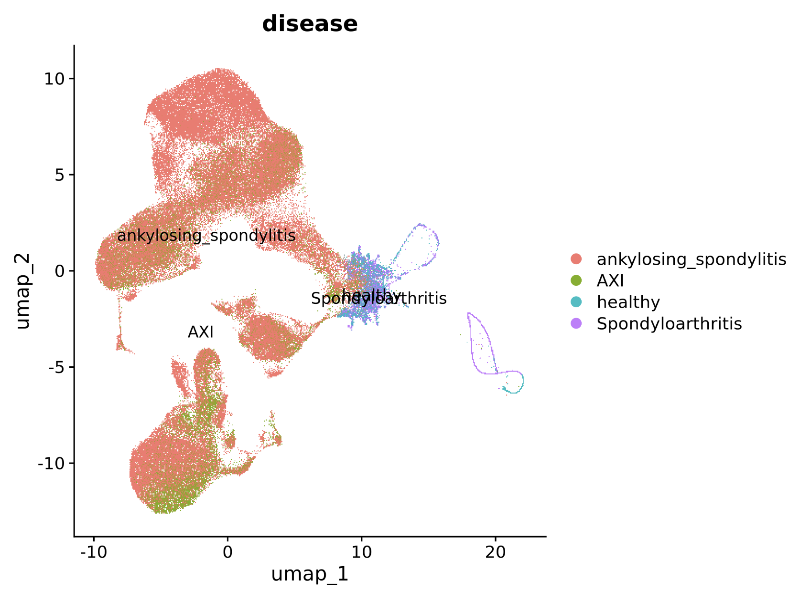

## UMAP After Batch correction and sample grouping

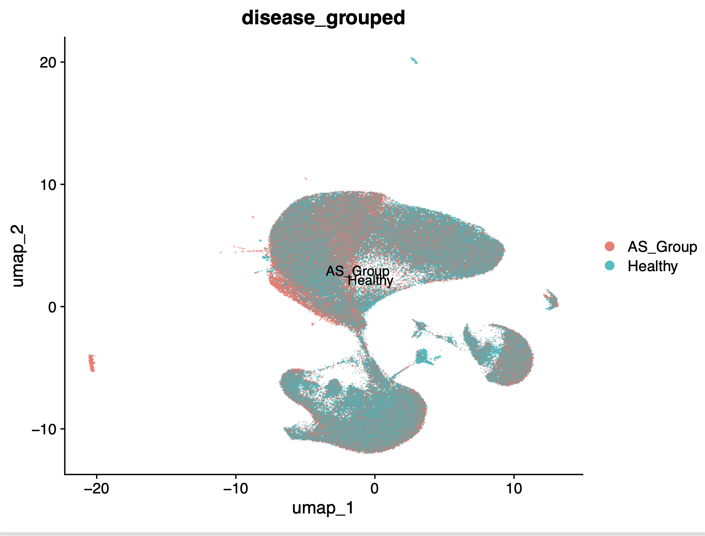


# Dimensionality Reduction and Cluster Identification
This script was used to perform dimensionality reduction and cell cluster identification. The batch corrected Seurat object was used as input and the samples that were not healthy were still grouped into one group labeled AS_Group. Data normalization and PCA were performed. Integrated Seurat functions such as NormalizeData and RunUMAP were used for this step. The FindMarkers function was used for cell type identification and RunUMAP was used to generate a UMAP based on transcript counts.


```{r eval=FALSE}
library(Seurat)
library(ggplot2)
library(dplyr)
library(harmony)
library(presto)
# Load the Seurat object
merged_seurat <- readRDS("merged_seurat_list.rds")
# Filter out NAs in the metadata if necessary
filtered_meta <- merged_seurat@meta.data[complete.cases(merged_seurat@meta.data), ]
merged_seurat <- subset(merged_seurat, cells = rownames(filtered_meta))
#Save features to a txt file
features <- rownames(merged_seurat)
write.table(features, file = "features.txt", col.names = TRUE, row.names = FALSE, sep = "\t")
# Create a new 'disease_grouped' column with only two groups: "AS_Group" and "Healthy"
merged_seurat@meta.data$disease_grouped <- ifelse(
  merged_seurat@meta.data$disease %in% c("AXI", "ankylosing_spondylitis", "Spondyloarthritis"), 
  "AS_Group", 
  "Healthy"
)
# Visualize QC metrics as a violin plot
violin <- VlnPlot(merged_seurat , features = c("nFeature_RNA", "nCount_RNA"), ncol = 2)
#ggsave(filename = "violin_plot_K.pdf", plot = violin, width = 8, height = 6, dpi = 300)
feature_scatter <- FeatureScatter(merged_seurat , feature1 = "nCount_RNA", feature2 = "nFeature_RNA")
#ggsave(filename = "feature_scatter_plot_K.pdf", plot = feature_scatter, width = 8, height = 6, dpi = 300)
# Normalize the data
merged_seurat <- NormalizeData(merged_seurat)
# Identify highly variable features
merged_seurat <- FindVariableFeatures(merged_seurat, selection.method="vst", nfeatures=2000)

# Identify the 10 most highly variable genes
top10 <- head(VariableFeatures(merged_seurat ), 10)

# plot variable features with and without labels
var_no_label <- VariableFeaturePlot(merged_seurat)
var_label <- LabelPoints(plot = var_no_label, points = top10, repel = TRUE)
#ggsave(filename = "var_no_label_K.pdf", plot = var_no_label, width = 8, height = 6, dpi = 300)
#ggsave(filename = "var_label_K.pdf", plot = var_label, width = 8, height = 6, dpi = 300)

# Scale the data
all.genes <- rownames(merged_seurat)
merged_seurat  <- ScaleData(merged_seurat, features = all.genes)

# Perform PCA
merged_seurat <- RunPCA(merged_seurat, features = VariableFeatures(object = merged_seurat))
loadings <- VizDimLoadings(merged_seurat, dims = 1:2, reduction = "pca")
#ggsave(filename = "loadings.pdf", plot = loadings, width = 8, height = 6, dpi = 300)

pca <- DimPlot(merged_seurat, reduction = "pca") + NoLegend()
#ggsave(filename = "pca.pdf", plot = pca, width = 8, height = 6, dpi = 300)

# Elbow plot
elbow <- ElbowPlot(merged_seurat)
#ggsave(filename = "elbow.pdf", plot = elbow, width = 8, height = 6, dpi = 300)

# Proceed with the Harmony and UMAP pipeline
merged_seurat <- RunHarmony(merged_seurat, group.by.vars = "sample")
merged_seurat <- FindNeighbors(merged_seurat, reduction = "harmony", dims = 1:10)
merged_seurat <- FindClusters(merged_seurat, resolution = 0.5)
merged_seurat <- RunUMAP(merged_seurat, reduction = "harmony", dims = 1:10)
saveRDS(merged_seurat, "umap_harmony.rds")

# Plot UMAP with the lumped disease categories
disease_lumped_plot <- DimPlot(merged_seurat, reduction = "umap", label = TRUE, group.by = "disease_grouped")
#ggsave(filename = "umap_disease_lumped_K.pdf", plot = disease_lumped_plot, width = 8, height = 6, dpi = 300)


print(file.exists("/scratch/alpine/ceck@xsede.org/Kuhn_Data/barcode_filtering/new_pipe/NEWBATCH/lump/umap_harmony.rds")) 
# Load the Seurat object
merged_seurat <- readRDS("/scratch/alpine/ceck@xsede.org/Kuhn_Data/barcode_filtering/new_pipe/NEWBATCH/lump/umap_harmony.rds")

# If needed, join layers (depending on your analysis setup)
merged_seurat <- JoinLayers(merged_seurat)

# Find markers for all clusters compared to the rest
merged_seurat.markers <- FindAllMarkers(merged_seurat, only.pos = TRUE)

# Extract the top 20 genes for each cluster
top_genes <- merged_seurat.markers %>%
  group_by(cluster) %>%
  dplyr::filter(avg_log2FC > 1) %>% # Filter for significant log fold changes
  slice_max(order_by = avg_log2FC, n = 20) %>% # Get top 20 per cluster
  ungroup()

# Rename clusters to more descriptive labels
new.cluster.ids <- c("Naive CD4 T", "CD14+ Mono", "Memory CD4 T", "B", "CD8 T", 
                     "FCGR3A+ Mono", "NK", "DC", "Platelet", rep("Other", 20))
names(new.cluster.ids) <- levels(merged_seurat)
merged_seurat <- RenameIdents(merged_seurat, new.cluster.ids)

# Map numeric clusters to descriptive labels
#top_genes_output <- top_genes %>%
# mutate(cell_type = new.cluster.ids[as.numeric(cluster)]) %>% # Add cell type column
# select(gene, cluster, cell_type) # Select relevant columns

# Map numeric clusters to descriptive labels and include p-value columns
top_genes_output <- top_genes %>%
  mutate(cell_type = new.cluster.ids[as.numeric(cluster)]) %>% # Add cell type column
  select(gene, cluster, cell_type, avg_log2FC, p_val, p_val_adj) 

# Save the top genes as a CSV file
write.csv(top_genes_output, "top20_genes_per_cluster_with_cell_types.csv", row.names = FALSE)

# Optional: Create a heatmap for visualization
top_genes_plot <- DoHeatmap(merged_seurat, features = top_genes$gene) + NoLegend()
ggsave(filename = "top_genes.pdf", plot = top_genes_plot, width = 20, height = 6, dpi = 300)

# Plot clusters with updated labels
cluster_ID <- DimPlot(merged_seurat, reduction = "umap", label = TRUE, pt.size = 0.5) + NoLegend()
ggsave(filename = "cluster_ID.pdf", plot = cluster_ID, width = 8, height = 6, dpi = 300)

```


## UMAP colored by Transcript counts

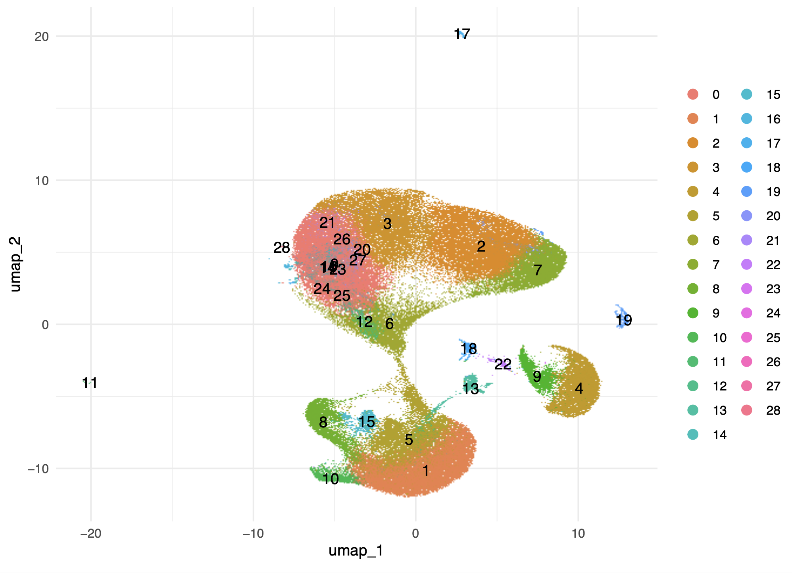

## UMAP colored by cell type

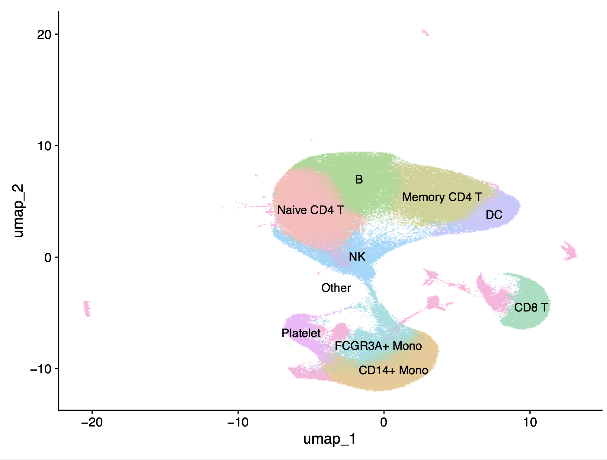

# DEG analysis

### DESeq2

This script was used to perform differential gene expression with DEseq2 for the initial analysis. Pseudobulking was executed based on disease grouping, cluster number, and sample ID. Groups were created using the Idents from the Seurat object. Diseased and healthy groups for each cell type were manually subsetted based on these Ident labels. Genes with counts of 0 were filtered out of the dataset and DESeq2 was run on the filtered object. Each comparison was saved as a rds object that contain gene lists, p-values, log fold change values, and adjusted p-values. For the final step, volcano plots were created using the log fold change and adjusted p-values from the DESeq2 results and the top 10 significant genes were labeled. Adjusted p-values were calculated using the Benjamini-Hochberg procedure to control the false discovery rate. Significance was defined as an adjusted p-value less than 0.05 and a log fold change greater than 1. Each plot was saved as a png. Although DESeq2 was successful for an all-vs all comparison of differentially expressed genes in healthy vs AS samples, I decided against using this pipeline for the final results because DESeq2 could not handle the sparsity of the datasets with subsetted cell types. 

```{r eval = FALSE, restults='hide'}
library(Seurat)
library(ggplot2)
library(dplyr)
library(Matrix)
library(DESeq2)
library(ggrepel)
library(tidyr)

# Step 1: Load the Seurat Object

# Load the Seurat object
merged_seurat <- readRDS("/scratch/alpine/ceck@xsede.org/Kuhn_Data/umap_harmony.rds")
print("Data Loaded")

# Print the dimensions of the Seurat object
print(dim(merged_seurat))

# Check the cell distribution across combined groups
print(table(Idents(merged_seurat)))

# Step 2: Seperate the combined diseased groups and seperate healthy
# Create a new 'disease_grouped' column with two groups: "AS_Group" and "Healthy"
merged_seurat@meta.data$disease_grouped <- ifelse(
  merged_seurat@meta.data$disease %in% c("AXI", "ankylosing_spondylitis", "Spondyloarthritis"), 
  "AS_Group", 
  "Healthy"
)
print("Groups Created")


# Join layers to access data
merged_seurat <- JoinLayers(merged_seurat)

# Step 3: Pseudobulk Data
# Aggregate expression data by cluster and treatment
pseudobulk_seurat <- AggregateExpression(
  merged_seurat,
  assays = "RNA",
  group.by = c("disease_grouped", "seurat_clusters", "sample"),
  return.seurat = TRUE
)

# Check the cell distribution across combined groups
print(table(Idents(pseudobulk_seurat)))
print("Pseudobulk Complete")


# Create a combined ID of disease group and cluster
pseudobulk_seurat$combined_id <- paste(
  pseudobulk_seurat@meta.data$disease_grouped,
  pseudobulk_seurat@meta.data$seurat_clusters,
  pseudobulk_seurat@meta.data$sample,
  sep = "_"
)
Idents(pseudobulk_seurat) <- "combined_id"


# Check the identities in pseudobulk_seurat
print("Available Idents:")
print(unique(Idents(pseudobulk_seurat)))
# Check the combined ID field
print("Combined IDs:")
print(pseudobulk_seurat$combined_id)
# Verify cluster names in the metadata
print("Unique clusters:")
print(unique(pseudobulk_seurat$seurat_clusters))


#Step 4: Subset the identities to be used in analysis
# Get the identities to keep
idents_to_keep <- c("AS-Group_0_27B", "AS-Group_0_AS01PB", "AS-Group_0_AS02PB", "AS-Group_0_PBMC-02-1-AXI", 
                "AS-Group_0_PBMC-02-2-AXI", "AS-Group_0_PBMC-02-3-AXI", "AS-Group_0_PBMC-02-4-AXI", 
                "AS-Group_0_PBMC-03-1-AXI", "AS-Group_0_PBMC-03-2-AXI", "AS-Group_0_PBMC-03-3-AXI", 
                "AS-Group_0_PBMC-03-4-AXI", "AS-Group_0_PBMC-04-1-AXI", "AS-Group_0_PBMC-04-2-AXI", 
                "AS-Group_0_PBMC-04-3-AXI", "AS-Group_0_PBMC-04-4-AXI", "AS-Group_0_PBMC-05-1-AXI", 
                "AS-Group_0_PBMC-05-2-AXI", "AS-Group_0_PBMC-05-3-AXI", "AS-Group_0_PBMC-05-4-AXI", 
                "AS-Group_0_PBMC-07-1", "AS-Group_0_PBMC-07-2", "AS-Group_0_PBMC-07-3", "AS-Group_0_PBMC-07-4",
                "AS-Group_1_AS01PB", "AS-Group_1_AS02PB", "AS-Group_1_PBMC-02-1-AXI", 
                "AS-Group_1_PBMC-02-2-AXI", "AS-Group_1_PBMC-02-3-AXI", "AS-Group_1_PBMC-02-4-AXI", 
                "AS-Group_1_PBMC-03-1-AXI", "AS-Group_1_PBMC-03-2-AXI", "AS-Group_1_PBMC-03-3-AXI", 
                "AS-Group_1_PBMC-03-4-AXI", "AS-Group_1_PBMC-04-1-AXI", "AS-Group_1_PBMC-04-2-AXI", 
                "AS-Group_1_PBMC-04-3-AXI", "AS-Group_1_PBMC-04-4-AXI", "AS-Group_1_PBMC-05-1-AXI", 
                "AS-Group_1_PBMC-05-2-AXI", "AS-Group_1_PBMC-05-3-AXI", "AS-Group_1_PBMC-05-4-AXI", 
                "AS-Group_1_PBMC-07-1", "AS-Group_1_PBMC-07-2", "AS-Group_1_PBMC-07-3", 
                "AS-Group_1_PBMC-07-4",
                "AS-Group_2_AS01PB", "AS-Group_2_AS02PB", "AS-Group_2_PBMC-02-1-AXI", 
                "AS-Group_2_PBMC-02-2-AXI", "AS-Group_2_PBMC-02-3-AXI", "AS-Group_2_PBMC-02-4-AXI", 
                "AS-Group_2_PBMC-03-1-AXI", "AS-Group_2_PBMC-03-2-AXI", "AS-Group_2_PBMC-03-3-AXI", 
                "AS-Group_2_PBMC-03-4-AXI", "AS-Group_2_PBMC-04-1-AXI", "AS-Group_2_PBMC-04-2-AXI", 
                "AS-Group_2_PBMC-04-3-AXI", "AS-Group_2_PBMC-04-4-AXI", "AS-Group_2_PBMC-05-1-AXI", 
                "AS-Group_2_PBMC-05-2-AXI", "AS-Group_2_PBMC-05-3-AXI", "AS-Group_2_PBMC-05-4-AXI", 
                "AS-Group_2_PBMC-07-1", "AS-Group_2_PBMC-07-2", "AS-Group_2_PBMC-07-3", 
                "AS-Group_2_PBMC-07-4",
                "AS-Group_4_AS01PB", "AS-Group_4_AS02PB", 
                "AS-Group_4_PBMC-02-1-AXI", "AS-Group_4_PBMC-02-2-AXI", 
                "AS-Group_4_PBMC-02-3-AXI", "AS-Group_4_PBMC-02-4-AXI", 
                "AS-Group_4_PBMC-03-1-AXI", "AS-Group_4_PBMC-03-2-AXI", 
                "AS-Group_4_PBMC-03-3-AXI", "AS-Group_4_PBMC-03-4-AXI", 
                "AS-Group_4_PBMC-04-1-AXI", "AS-Group_4_PBMC-04-2-AXI", 
                "AS-Group_4_PBMC-04-3-AXI", "AS-Group_4_PBMC-04-4-AXI", 
                "AS-Group_4_PBMC-05-1-AXI", "AS-Group_4_PBMC-05-2-AXI", 
                "AS-Group_4_PBMC-05-3-AXI", "AS-Group_4_PBMC-05-4-AXI", 
                "AS-Group_4_PBMC-07-1", "AS-Group_4_PBMC-07-2", 
                "AS-Group_4_PBMC-07-3", "AS-Group_4_PBMC-07-4",
                "AS-Group_5_AS01PB", 
                "AS-Group_5_AS02PB", "AS-Group_5_PBMC-02-1-AXI", 
                "AS-Group_5_PBMC-02-2-AXI", "AS-Group_5_PBMC-02-3-AXI", 
                "AS-Group_5_PBMC-02-4-AXI", "AS-Group_5_PBMC-03-1-AXI", 
                "AS-Group_5_PBMC-03-2-AXI", "AS-Group_5_PBMC-03-3-AXI", 
                "AS-Group_5_PBMC-03-4-AXI", "AS-Group_5_PBMC-04-1-AXI", 
                "AS-Group_5_PBMC-04-2-AXI", "AS-Group_5_PBMC-04-3-AXI", 
                "AS-Group_5_PBMC-04-4-AXI", "AS-Group_5_PBMC-05-1-AXI", 
                "AS-Group_5_PBMC-05-2-AXI", "AS-Group_5_PBMC-05-3-AXI", 
                "AS-Group_5_PBMC-05-4-AXI", "AS-Group_5_PBMC-07-1", 
                "AS-Group_5_PBMC-07-2", "AS-Group_5_PBMC-07-3", 
                "AS-Group_5_PBMC-07-4",
                "Healthy_0_21B", "Healthy_0_PBMC-01-3-Healthy", "Healthy_0_PBMC-01-4-Healthy", 
                "Healthy_0_PBMC-02-1-Healthy", "Healthy_0_PBMC-02-2-Healthy", "Healthy_0_PBMC-02-3-Healthy", 
                "Healthy_0_PBMC-02-4-Healthy", "Healthy_0_PBMC-03-1-Healthy", "Healthy_0_PBMC-03-2-Healthy", 
                "Healthy_0_PBMC-03-3-Healthy", "Healthy_0_PBMC-03-4-Healthy", "Healthy_0_PBMC-04-1-Healthy", 
                "Healthy_0_PBMC-04-2-Healthy", "Healthy_0_PBMC-04-3-Healthy", "Healthy_0_PBMC-04-4-Healthy", 
                "Healthy_0_PBMC-05-1-Healthy", "Healthy_0_PBMC-05-2-Healthy", "Healthy_0_PBMC-05-3-Healthy", 
                "Healthy_0_PBMC-05-4-Healthy",
                "Healthy_1_PBMC-01-3-Healthy", "Healthy_1_PBMC-01-4-Healthy", 
                "Healthy_1_PBMC-02-1-Healthy", "Healthy_1_PBMC-02-2-Healthy", 
                "Healthy_1_PBMC-02-3-Healthy", "Healthy_1_PBMC-02-4-Healthy", 
                "Healthy_1_PBMC-03-1-Healthy", "Healthy_1_PBMC-03-2-Healthy", 
                "Healthy_1_PBMC-03-3-Healthy", "Healthy_1_PBMC-03-4-Healthy", 
                "Healthy_1_PBMC-04-1-Healthy", "Healthy_1_PBMC-04-2-Healthy", 
                "Healthy_1_PBMC-04-3-Healthy", "Healthy_1_PBMC-04-4-Healthy", 
                "Healthy_1_PBMC-05-1-Healthy", "Healthy_1_PBMC-05-2-Healthy", 
                "Healthy_1_PBMC-05-3-Healthy", "Healthy_1_PBMC-05-4-Healthy",
                "Healthy_2_PBMC-01-3-Healthy", "Healthy_2_PBMC-01-4-Healthy", 
                "Healthy_2_PBMC-02-1-Healthy", "Healthy_2_PBMC-02-2-Healthy", 
                "Healthy_2_PBMC-02-3-Healthy", "Healthy_2_PBMC-02-4-Healthy", 
                "Healthy_2_PBMC-03-1-Healthy", "Healthy_2_PBMC-03-2-Healthy", 
                "Healthy_2_PBMC-03-3-Healthy", "Healthy_2_PBMC-03-4-Healthy", 
                "Healthy_2_PBMC-04-1-Healthy", "Healthy_2_PBMC-04-2-Healthy", 
                "Healthy_2_PBMC-04-3-Healthy", "Healthy_2_PBMC-04-4-Healthy", 
                "Healthy_2_PBMC-05-1-Healthy", "Healthy_2_PBMC-05-2-Healthy", 
                "Healthy_2_PBMC-05-3-Healthy", "Healthy_2_PBMC-05-4-Healthy",
                "Healthy_4_PBMC-01-3-Healthy", 
                "Healthy_4_PBMC-01-4-Healthy", 
                "Healthy_4_PBMC-02-1-Healthy", "Healthy_4_PBMC-02-2-Healthy", "Healthy_4_PBMC-02-3-Healthy", 
                "Healthy_4_PBMC-02-4-Healthy", "Healthy_4_PBMC-03-1-Healthy", "Healthy_4_PBMC-03-2-Healthy", 
                "Healthy_4_PBMC-03-3-Healthy", "Healthy_4_PBMC-03-4-Healthy", "Healthy_4_PBMC-04-1-Healthy", 
                "Healthy_4_PBMC-04-2-Healthy", "Healthy_4_PBMC-04-3-Healthy", "Healthy_4_PBMC-04-4-Healthy", 
                "Healthy_4_PBMC-05-1-Healthy", "Healthy_4_PBMC-05-2-Healthy", "Healthy_4_PBMC-05-3-Healthy", 
                "Healthy_4_PBMC-05-4-Healthy",
                "Healthy_5_PBMC-01-3-Healthy", "Healthy_5_PBMC-01-4-Healthy", 
                "Healthy_5_PBMC-02-1-Healthy", "Healthy_5_PBMC-02-2-Healthy", 
                "Healthy_5_PBMC-02-3-Healthy", "Healthy_5_PBMC-02-4-Healthy", 
                "Healthy_5_PBMC-03-1-Healthy", "Healthy_5_PBMC-03-2-Healthy", 
                "Healthy_5_PBMC-03-3-Healthy", "Healthy_5_PBMC-03-4-Healthy", 
                "Healthy_5_PBMC-04-1-Healthy", "Healthy_5_PBMC-04-2-Healthy", 
                "Healthy_5_PBMC-04-3-Healthy", "Healthy_5_PBMC-04-4-Healthy", 
                "Healthy_5_PBMC-05-1-Healthy", "Healthy_5_PBMC-05-2-Healthy", 
                "Healthy_5_PBMC-05-3-Healthy", "Healthy_5_PBMC-05-4-Healthy"
                )

# Subset the Seurat object
pseudobulk_seurat <- subset(pseudobulk_seurat, idents = idents_to_keep)

# Check the identities in the filtered object
print("Filtered Idents:")
table(Idents(pseudobulk_seurat))

# Check the identities in pseudobulk_seurat
#print(unique(Idents(pseudobulk_seurat)))
# Check the combined ID field
print("Combined IDs:")
print(pseudobulk_seurat$combined_id)

print("Seurat Object Subsetted Successfully")


# Step 5: Define the Comparisons for DEseq analysis from subsetted object
comparisons <- list(
  AS_Group_vs_Healthy = list(
    ident.1 = c("AS-Group_0_27B", "AS-Group_0_AS01PB", "AS-Group_0_AS02PB", "AS-Group_0_PBMC-02-1-AXI", 
                "AS-Group_0_PBMC-02-2-AXI", "AS-Group_0_PBMC-02-3-AXI", "AS-Group_0_PBMC-02-4-AXI", 
                "AS-Group_0_PBMC-03-1-AXI", "AS-Group_0_PBMC-03-2-AXI", "AS-Group_0_PBMC-03-3-AXI", 
                "AS-Group_0_PBMC-03-4-AXI", "AS-Group_0_PBMC-04-1-AXI", "AS-Group_0_PBMC-04-2-AXI", 
                "AS-Group_0_PBMC-04-3-AXI", "AS-Group_0_PBMC-04-4-AXI", "AS-Group_0_PBMC-05-1-AXI", 
                "AS-Group_0_PBMC-05-2-AXI", "AS-Group_0_PBMC-05-3-AXI", "AS-Group_0_PBMC-05-4-AXI", 
                "AS-Group_0_PBMC-07-1", "AS-Group_0_PBMC-07-2", "AS-Group_0_PBMC-07-3", "AS-Group_0_PBMC-07-4",
                "AS-Group_1_AS01PB", "AS-Group_1_AS02PB", "AS-Group_1_PBMC-02-1-AXI", 
                "AS-Group_1_PBMC-02-2-AXI", "AS-Group_1_PBMC-02-3-AXI", "AS-Group_1_PBMC-02-4-AXI", 
                "AS-Group_1_PBMC-03-1-AXI", "AS-Group_1_PBMC-03-2-AXI", "AS-Group_1_PBMC-03-3-AXI", 
                "AS-Group_1_PBMC-03-4-AXI", "AS-Group_1_PBMC-04-1-AXI", "AS-Group_1_PBMC-04-2-AXI", 
                "AS-Group_1_PBMC-04-3-AXI", "AS-Group_1_PBMC-04-4-AXI", "AS-Group_1_PBMC-05-1-AXI", 
                "AS-Group_1_PBMC-05-2-AXI", "AS-Group_1_PBMC-05-3-AXI", "AS-Group_1_PBMC-05-4-AXI", 
                "AS-Group_1_PBMC-07-1", "AS-Group_1_PBMC-07-2", "AS-Group_1_PBMC-07-3", 
                "AS-Group_1_PBMC-07-4",
                "AS-Group_2_AS01PB", "AS-Group_2_AS02PB", "AS-Group_2_PBMC-02-1-AXI", 
                "AS-Group_2_PBMC-02-2-AXI", "AS-Group_2_PBMC-02-3-AXI", "AS-Group_2_PBMC-02-4-AXI", 
                "AS-Group_2_PBMC-03-1-AXI", "AS-Group_2_PBMC-03-2-AXI", "AS-Group_2_PBMC-03-3-AXI", 
                "AS-Group_2_PBMC-03-4-AXI", "AS-Group_2_PBMC-04-1-AXI", "AS-Group_2_PBMC-04-2-AXI", 
                "AS-Group_2_PBMC-04-3-AXI", "AS-Group_2_PBMC-04-4-AXI", "AS-Group_2_PBMC-05-1-AXI", 
                "AS-Group_2_PBMC-05-2-AXI", "AS-Group_2_PBMC-05-3-AXI", "AS-Group_2_PBMC-05-4-AXI", 
                "AS-Group_2_PBMC-07-1", "AS-Group_2_PBMC-07-2", "AS-Group_2_PBMC-07-3", 
                "AS-Group_2_PBMC-07-4",
                "AS-Group_4_AS01PB", "AS-Group_4_AS02PB", 
                "AS-Group_4_PBMC-02-1-AXI", "AS-Group_4_PBMC-02-2-AXI", 
                "AS-Group_4_PBMC-02-3-AXI", "AS-Group_4_PBMC-02-4-AXI", 
                "AS-Group_4_PBMC-03-1-AXI", "AS-Group_4_PBMC-03-2-AXI", 
                "AS-Group_4_PBMC-03-3-AXI", "AS-Group_4_PBMC-03-4-AXI", 
                "AS-Group_4_PBMC-04-1-AXI", "AS-Group_4_PBMC-04-2-AXI", 
                "AS-Group_4_PBMC-04-3-AXI", "AS-Group_4_PBMC-04-4-AXI", 
                "AS-Group_4_PBMC-05-1-AXI", "AS-Group_4_PBMC-05-2-AXI", 
                "AS-Group_4_PBMC-05-3-AXI", "AS-Group_4_PBMC-05-4-AXI", 
                "AS-Group_4_PBMC-07-1", "AS-Group_4_PBMC-07-2", 
                "AS-Group_4_PBMC-07-3", "AS-Group_4_PBMC-07-4",
                "AS-Group_5_AS01PB", 
                "AS-Group_5_AS02PB", "AS-Group_5_PBMC-02-1-AXI", 
                "AS-Group_5_PBMC-02-2-AXI", "AS-Group_5_PBMC-02-3-AXI", 
                "AS-Group_5_PBMC-02-4-AXI", "AS-Group_5_PBMC-03-1-AXI", 
                "AS-Group_5_PBMC-03-2-AXI", "AS-Group_5_PBMC-03-3-AXI", 
                "AS-Group_5_PBMC-03-4-AXI", "AS-Group_5_PBMC-04-1-AXI", 
                "AS-Group_5_PBMC-04-2-AXI", "AS-Group_5_PBMC-04-3-AXI", 
                "AS-Group_5_PBMC-04-4-AXI", "AS-Group_5_PBMC-05-1-AXI", 
                "AS-Group_5_PBMC-05-2-AXI", "AS-Group_5_PBMC-05-3-AXI", 
                "AS-Group_5_PBMC-05-4-AXI", "AS-Group_5_PBMC-07-1", 
                "AS-Group_5_PBMC-07-2", "AS-Group_5_PBMC-07-3", 
                "AS-Group_5_PBMC-07-4"),  
                
                
    ident.2 = c("Healthy_0_21B", "Healthy_0_PBMC-01-3-Healthy", "Healthy_0_PBMC-01-4-Healthy", 
                "Healthy_0_PBMC-02-1-Healthy", "Healthy_0_PBMC-02-2-Healthy", "Healthy_0_PBMC-02-3-Healthy", 
                "Healthy_0_PBMC-02-4-Healthy", "Healthy_0_PBMC-03-1-Healthy", "Healthy_0_PBMC-03-2-Healthy", 
                "Healthy_0_PBMC-03-3-Healthy", "Healthy_0_PBMC-03-4-Healthy", "Healthy_0_PBMC-04-1-Healthy", 
                "Healthy_0_PBMC-04-2-Healthy", "Healthy_0_PBMC-04-3-Healthy", "Healthy_0_PBMC-04-4-Healthy", 
                "Healthy_0_PBMC-05-1-Healthy", "Healthy_0_PBMC-05-2-Healthy", "Healthy_0_PBMC-05-3-Healthy", 
                "Healthy_0_PBMC-05-4-Healthy",
                "Healthy_1_PBMC-01-3-Healthy", "Healthy_1_PBMC-01-4-Healthy", 
                "Healthy_1_PBMC-02-1-Healthy", "Healthy_1_PBMC-02-2-Healthy", 
                "Healthy_1_PBMC-02-3-Healthy", "Healthy_1_PBMC-02-4-Healthy", 
                "Healthy_1_PBMC-03-1-Healthy", "Healthy_1_PBMC-03-2-Healthy", 
                "Healthy_1_PBMC-03-3-Healthy", "Healthy_1_PBMC-03-4-Healthy", 
                "Healthy_1_PBMC-04-1-Healthy", "Healthy_1_PBMC-04-2-Healthy", 
                "Healthy_1_PBMC-04-3-Healthy", "Healthy_1_PBMC-04-4-Healthy", 
                "Healthy_1_PBMC-05-1-Healthy", "Healthy_1_PBMC-05-2-Healthy", 
                "Healthy_1_PBMC-05-3-Healthy", "Healthy_1_PBMC-05-4-Healthy",
                "Healthy_2_PBMC-01-3-Healthy", "Healthy_2_PBMC-01-4-Healthy", 
                "Healthy_2_PBMC-02-1-Healthy", "Healthy_2_PBMC-02-2-Healthy", 
                "Healthy_2_PBMC-02-3-Healthy", "Healthy_2_PBMC-02-4-Healthy", 
                "Healthy_2_PBMC-03-1-Healthy", "Healthy_2_PBMC-03-2-Healthy", 
                "Healthy_2_PBMC-03-3-Healthy", "Healthy_2_PBMC-03-4-Healthy", 
                "Healthy_2_PBMC-04-1-Healthy", "Healthy_2_PBMC-04-2-Healthy", 
                "Healthy_2_PBMC-04-3-Healthy", "Healthy_2_PBMC-04-4-Healthy", 
                "Healthy_2_PBMC-05-1-Healthy", "Healthy_2_PBMC-05-2-Healthy", 
                "Healthy_2_PBMC-05-3-Healthy", "Healthy_2_PBMC-05-4-Healthy",
                "Healthy_4_PBMC-01-3-Healthy", 
                "Healthy_4_PBMC-01-4-Healthy", 
                "Healthy_4_PBMC-02-1-Healthy", "Healthy_4_PBMC-02-2-Healthy", "Healthy_4_PBMC-02-3-Healthy", 
                "Healthy_4_PBMC-02-4-Healthy", "Healthy_4_PBMC-03-1-Healthy", "Healthy_4_PBMC-03-2-Healthy", 
                "Healthy_4_PBMC-03-3-Healthy", "Healthy_4_PBMC-03-4-Healthy", "Healthy_4_PBMC-04-1-Healthy", 
                "Healthy_4_PBMC-04-2-Healthy", "Healthy_4_PBMC-04-3-Healthy", "Healthy_4_PBMC-04-4-Healthy", 
                "Healthy_4_PBMC-05-1-Healthy", "Healthy_4_PBMC-05-2-Healthy", "Healthy_4_PBMC-05-3-Healthy", 
                "Healthy_4_PBMC-05-4-Healthy",
                "Healthy_5_PBMC-01-3-Healthy", "Healthy_5_PBMC-01-4-Healthy", 
                "Healthy_5_PBMC-02-1-Healthy", "Healthy_5_PBMC-02-2-Healthy", 
                "Healthy_5_PBMC-02-3-Healthy", "Healthy_5_PBMC-02-4-Healthy", 
                "Healthy_5_PBMC-03-1-Healthy", "Healthy_5_PBMC-03-2-Healthy", 
                "Healthy_5_PBMC-03-3-Healthy", "Healthy_5_PBMC-03-4-Healthy", 
                "Healthy_5_PBMC-04-1-Healthy", "Healthy_5_PBMC-04-2-Healthy", 
                "Healthy_5_PBMC-04-3-Healthy", "Healthy_5_PBMC-04-4-Healthy", 
                "Healthy_5_PBMC-05-1-Healthy", "Healthy_5_PBMC-05-2-Healthy", 
                "Healthy_5_PBMC-05-3-Healthy", "Healthy_5_PBMC-05-4-Healthy")
  ),
  
  AS_Group_Naive_vs_Healthy_Naive = list(
    ident.1 = c("AS-Group_0_27B", "AS-Group_0_AS01PB", "AS-Group_0_AS02PB", "AS-Group_0_PBMC-02-1-AXI", 
                "AS-Group_0_PBMC-02-2-AXI", "AS-Group_0_PBMC-02-3-AXI", "AS-Group_0_PBMC-02-4-AXI", 
                "AS-Group_0_PBMC-03-1-AXI", "AS-Group_0_PBMC-03-2-AXI", "AS-Group_0_PBMC-03-3-AXI", 
                "AS-Group_0_PBMC-03-4-AXI", "AS-Group_0_PBMC-04-1-AXI", "AS-Group_0_PBMC-04-2-AXI", 
                "AS-Group_0_PBMC-04-3-AXI", "AS-Group_0_PBMC-04-4-AXI", "AS-Group_0_PBMC-05-1-AXI", 
                "AS-Group_0_PBMC-05-2-AXI", "AS-Group_0_PBMC-05-3-AXI", "AS-Group_0_PBMC-05-4-AXI", 
                "AS-Group_0_PBMC-07-1", "AS-Group_0_PBMC-07-2", "AS-Group_0_PBMC-07-3", "AS-Group_0_PBMC-07-4"),  
                
    ident.2 = c("Healthy_0_21B", "Healthy_0_PBMC-01-3-Healthy", "Healthy_0_PBMC-01-4-Healthy", 
  "Healthy_0_PBMC-02-1-Healthy", "Healthy_0_PBMC-02-2-Healthy", "Healthy_0_PBMC-02-3-Healthy", 
  "Healthy_0_PBMC-02-4-Healthy", "Healthy_0_PBMC-03-1-Healthy", "Healthy_0_PBMC-03-2-Healthy", 
  "Healthy_0_PBMC-03-3-Healthy", "Healthy_0_PBMC-03-4-Healthy", "Healthy_0_PBMC-04-1-Healthy", 
  "Healthy_0_PBMC-04-2-Healthy", "Healthy_0_PBMC-04-3-Healthy", "Healthy_0_PBMC-04-4-Healthy", 
  "Healthy_0_PBMC-05-1-Healthy", "Healthy_0_PBMC-05-2-Healthy", "Healthy_0_PBMC-05-3-Healthy", 
  "Healthy_0_PBMC-05-4-Healthy")
  ),
  
  AS_Group_CD14Mono_vs_Healthy_CD14Mono = list(
    ident.1 = c("AS-Group_1_AS01PB", "AS-Group_1_AS02PB", "AS-Group_1_PBMC-02-1-AXI", 
                "AS-Group_1_PBMC-02-2-AXI", "AS-Group_1_PBMC-02-3-AXI", "AS-Group_1_PBMC-02-4-AXI", 
                "AS-Group_1_PBMC-03-1-AXI", "AS-Group_1_PBMC-03-2-AXI", "AS-Group_1_PBMC-03-3-AXI", 
                "AS-Group_1_PBMC-03-4-AXI", "AS-Group_1_PBMC-04-1-AXI", "AS-Group_1_PBMC-04-2-AXI", 
                "AS-Group_1_PBMC-04-3-AXI", "AS-Group_1_PBMC-04-4-AXI", "AS-Group_1_PBMC-05-1-AXI", 
                "AS-Group_1_PBMC-05-2-AXI", "AS-Group_1_PBMC-05-3-AXI", "AS-Group_1_PBMC-05-4-AXI", 
                "AS-Group_1_PBMC-07-1", "AS-Group_1_PBMC-07-2", "AS-Group_1_PBMC-07-3", 
                "AS-Group_1_PBMC-07-4"),
  
    ident.2 = c("Healthy_1_PBMC-01-3-Healthy", "Healthy_1_PBMC-01-4-Healthy", 
                "Healthy_1_PBMC-02-1-Healthy", "Healthy_1_PBMC-02-2-Healthy", 
                "Healthy_1_PBMC-02-3-Healthy", "Healthy_1_PBMC-02-4-Healthy", 
                "Healthy_1_PBMC-03-1-Healthy", "Healthy_1_PBMC-03-2-Healthy", 
                "Healthy_1_PBMC-03-3-Healthy", "Healthy_1_PBMC-03-4-Healthy", 
                "Healthy_1_PBMC-04-1-Healthy", "Healthy_1_PBMC-04-2-Healthy", 
                "Healthy_1_PBMC-04-3-Healthy", "Healthy_1_PBMC-04-4-Healthy", 
                "Healthy_1_PBMC-05-1-Healthy", "Healthy_1_PBMC-05-2-Healthy", 
                "Healthy_1_PBMC-05-3-Healthy", "Healthy_1_PBMC-05-4-Healthy")
  ),
  
  AS_Group_MemoryCD4_vs_Healthy_MemoryCD4 = list(
    ident.1 = c("AS-Group_2_AS01PB", "AS-Group_2_AS02PB", "AS-Group_2_PBMC-02-1-AXI", 
                "AS-Group_2_PBMC-02-2-AXI", "AS-Group_2_PBMC-02-3-AXI", "AS-Group_2_PBMC-02-4-AXI", 
                "AS-Group_2_PBMC-03-1-AXI", "AS-Group_2_PBMC-03-2-AXI", "AS-Group_2_PBMC-03-3-AXI", 
                "AS-Group_2_PBMC-03-4-AXI", "AS-Group_2_PBMC-04-1-AXI", "AS-Group_2_PBMC-04-2-AXI", 
                "AS-Group_2_PBMC-04-3-AXI", "AS-Group_2_PBMC-04-4-AXI", "AS-Group_2_PBMC-05-1-AXI", 
                "AS-Group_2_PBMC-05-2-AXI", "AS-Group_2_PBMC-05-3-AXI", "AS-Group_2_PBMC-05-4-AXI", 
                "AS-Group_2_PBMC-07-1", "AS-Group_2_PBMC-07-2", "AS-Group_2_PBMC-07-3", 
                "AS-Group_2_PBMC-07-4"),  
    ident.2 = c("Healthy_2_PBMC-01-3-Healthy", "Healthy_2_PBMC-01-4-Healthy", 
                "Healthy_2_PBMC-02-1-Healthy", "Healthy_2_PBMC-02-2-Healthy", 
                "Healthy_2_PBMC-02-3-Healthy", "Healthy_2_PBMC-02-4-Healthy", 
                "Healthy_2_PBMC-03-1-Healthy", "Healthy_2_PBMC-03-2-Healthy", 
                "Healthy_2_PBMC-03-3-Healthy", "Healthy_2_PBMC-03-4-Healthy", 
                "Healthy_2_PBMC-04-1-Healthy", "Healthy_2_PBMC-04-2-Healthy", 
                "Healthy_2_PBMC-04-3-Healthy", "Healthy_2_PBMC-04-4-Healthy", 
                "Healthy_2_PBMC-05-1-Healthy", "Healthy_2_PBMC-05-2-Healthy", 
                "Healthy_2_PBMC-05-3-Healthy", "Healthy_2_PBMC-05-4-Healthy")
  ),
  
  AS_Group_CD8T_vs_Healthy_CD8T = list(
    ident.1 = c("AS-Group_4_AS01PB", "AS-Group_4_AS02PB", 
                "AS-Group_4_PBMC-02-1-AXI", "AS-Group_4_PBMC-02-2-AXI", 
                "AS-Group_4_PBMC-02-3-AXI", "AS-Group_4_PBMC-02-4-AXI", 
                "AS-Group_4_PBMC-03-1-AXI", "AS-Group_4_PBMC-03-2-AXI", 
                "AS-Group_4_PBMC-03-3-AXI", "AS-Group_4_PBMC-03-4-AXI", 
                "AS-Group_4_PBMC-04-1-AXI", "AS-Group_4_PBMC-04-2-AXI", 
                "AS-Group_4_PBMC-04-3-AXI", "AS-Group_4_PBMC-04-4-AXI", 
                "AS-Group_4_PBMC-05-1-AXI", "AS-Group_4_PBMC-05-2-AXI", 
                "AS-Group_4_PBMC-05-3-AXI", "AS-Group_4_PBMC-05-4-AXI", 
                "AS-Group_4_PBMC-07-1", "AS-Group_4_PBMC-07-2", 
                "AS-Group_4_PBMC-07-3", "AS-Group_4_PBMC-07-4"),  
                
    ident.2 = c("Healthy_4_PBMC-01-3-Healthy", "Healthy_4_PBMC-01-4-Healthy", 
  "Healthy_4_PBMC-02-1-Healthy", "Healthy_4_PBMC-02-2-Healthy", "Healthy_4_PBMC-02-3-Healthy", 
  "Healthy_4_PBMC-02-4-Healthy", "Healthy_4_PBMC-03-1-Healthy", "Healthy_4_PBMC-03-2-Healthy", 
  "Healthy_4_PBMC-03-3-Healthy", "Healthy_4_PBMC-03-4-Healthy", "Healthy_4_PBMC-04-1-Healthy", 
  "Healthy_4_PBMC-04-2-Healthy", "Healthy_4_PBMC-04-3-Healthy", "Healthy_4_PBMC-04-4-Healthy", 
  "Healthy_4_PBMC-05-1-Healthy", "Healthy_4_PBMC-05-2-Healthy", "Healthy_4_PBMC-05-3-Healthy", 
  "Healthy_4_PBMC-05-4-Healthy")
  ),
  
  AS_Group_FCGR3AMono_vs_Healthy_FCGR3AMono = list(
    ident.1 = c("AS-Group_5_AS01PB", 
  "AS-Group_5_AS02PB", "AS-Group_5_PBMC-02-1-AXI", 
  "AS-Group_5_PBMC-02-2-AXI", "AS-Group_5_PBMC-02-3-AXI", 
  "AS-Group_5_PBMC-02-4-AXI", "AS-Group_5_PBMC-03-1-AXI", 
  "AS-Group_5_PBMC-03-2-AXI", "AS-Group_5_PBMC-03-3-AXI", 
  "AS-Group_5_PBMC-03-4-AXI", "AS-Group_5_PBMC-04-1-AXI", 
  "AS-Group_5_PBMC-04-2-AXI", "AS-Group_5_PBMC-04-3-AXI", 
  "AS-Group_5_PBMC-04-4-AXI", "AS-Group_5_PBMC-05-1-AXI", 
  "AS-Group_5_PBMC-05-2-AXI", "AS-Group_5_PBMC-05-3-AXI", 
  "AS-Group_5_PBMC-05-4-AXI", "AS-Group_5_PBMC-07-1", 
  "AS-Group_5_PBMC-07-2", "AS-Group_5_PBMC-07-3", 
  "AS-Group_5_PBMC-07-4"),  
  
    ident.2 = c("Healthy_5_PBMC-01-3-Healthy", "Healthy_5_PBMC-01-4-Healthy", 
                "Healthy_5_PBMC-02-1-Healthy", "Healthy_5_PBMC-02-2-Healthy", 
                "Healthy_5_PBMC-02-3-Healthy", "Healthy_5_PBMC-02-4-Healthy", 
                "Healthy_5_PBMC-03-1-Healthy", "Healthy_5_PBMC-03-2-Healthy", 
                "Healthy_5_PBMC-03-3-Healthy", "Healthy_5_PBMC-03-4-Healthy", 
                "Healthy_5_PBMC-04-1-Healthy", "Healthy_5_PBMC-04-2-Healthy", 
                "Healthy_5_PBMC-04-3-Healthy", "Healthy_5_PBMC-04-4-Healthy", 
                "Healthy_5_PBMC-05-1-Healthy", "Healthy_5_PBMC-05-2-Healthy", 
                "Healthy_5_PBMC-05-3-Healthy", "Healthy_5_PBMC-05-4-Healthy")
  )
)
print("Clusters Defined")

# Step 6: Filter out low expression genes
counts_matrix <- GetAssayData(pseudobulk_seurat, assay = "RNA", layer = "counts")


# Check the number of features before and after filtering
initial_features <- nrow(counts_matrix)

# Keep rows with elements greater than 1
#filtered_counts_matrix <- counts_matrix[rowSums(counts_matrix > 1) > 1, ]

# Keep rows with elements greater than 0
filtered_counts_matrix <- counts_matrix[rowSums(counts_matrix > 0) > 1, ]
filtered_features <- nrow(filtered_counts_matrix)

print(paste("Initial features:", initial_features))
print(paste("Filtered features:", filtered_features))

# Filter out low expression genes
#counts_matrix <- GetAssayData(pseudobulk_seurat, assay = "RNA", layer = "counts")

# Update the Seurat object with the filtered features
pseudobulk_seurat <- subset(pseudobulk_seurat, features = rownames(filtered_counts_matrix))

# Step 7: Perform Differential Expression Analysis
de_results_list <- lapply(names(comparisons), function(comp_name) {
  comp <- comparisons[[comp_name]]
  de_results <- FindMarkers(
    object = pseudobulk_seurat,
    ident.1 = comp$ident.1,
    ident.2 = comp$ident.2,
    test.use = "DESeq2"
  )
  de_results$gene <- rownames(de_results)
  de_results$comparison <- comp_name
  
    # Save each DE result as an .rds file
  saveRDS(de_results, paste0("DESeq2_results_", comp_name, ".rds"))
  
  return(de_results)
})

# Combine results into a single data frame
all_de_results <- do.call(rbind, de_results_list)

# Step 8: Annotate Data for Volcano Plots
all_de_results <- all_de_results %>%
  mutate(
    significance = case_when(
      p_val_adj < 0.05 & abs(avg_log2FC) > 1 ~ "Significant",
      TRUE ~ "Not Significant"
    )
  )

# Step 9: Generate Volcano Plots for Each Comparison
volcano_plots <- lapply(unique(all_de_results$comparison), function(comp_name) {
  comp_data <- all_de_results %>% filter(comparison == comp_name)
  
  # Identify top 10 significant genes based on p-value and log2FC
  top_genes <- comp_data %>%
    filter(significance == "Significant") %>%
    arrange(p_val_adj) %>%
    top_n(10, wt = -log10(p_val_adj)) %>%
    pull(gene)
  
  p <- ggplot(comp_data, aes(x = avg_log2FC, y = -log10(p_val_adj), color = significance)) +
    geom_point(alpha = 0.8, size = 2) +
    scale_color_manual(values = c("Significant" = "red", "Not Significant" = "gray")) +
    theme_minimal() +
    labs(
      title = paste("Volcano Plot:", comp_name),
      x = "Log2 Fold Change",
      y = "-Log10 Adjusted P-Value"
    ) +
    # Add labels for the top 10 significant genes
    geom_text_repel(
      data = comp_data %>% filter(gene %in% top_genes),
      aes(label = gene),
      box.padding = 0.35, 
      point.padding = 0.5,
      max.overlaps = 10
    )
  
  # Save the plot
  ggsave(paste0("volcano_plot_", comp_name, ".pdf"), plot = p, width = 8, height = 6)
  
  return(p)
})
print("Pseudobulk analysis and volcano plots complete.")

```


### Wilcoxon Rank Sum Test

This script was used to perform differential gene expression with the Wilcoxon rank sum test. Pseudobulking was removed for this script to conserve cell counts in cell subsets. A normalized count matrix pulled from the Seurat object was the input for this test. Groups were created using the Idents from the Seurat object. Diseased and healthy groups for each cell type were manually subsetted based on these Ident labels. Genes with counts of 0 were filtered out of the dataset and Wilcox was run on the filtered object. Each comparison was saved as a rds object that contain gene lists, p-values, log fold change values, and adjusted p-values. For the final step, volcano plots were created using the log fold change and adjusted p-values from the Wilcox results and the top 15 significant upregulated and downregulated genes were labeled. Upregulated genes in the disease group are red and down regulated genes in the disease group are blue. Adjusted p-values were calculated using the Benjamini-Hochberg procedure to control the false discovery rate. Significance was defined as an adjusted p-value less than 0.05 and a log fold change greater than 1. Each plot was saved as a png. 

```{r, eval=FALSE}
library(Seurat)
library(ggplot2)
library(dplyr)
library(Matrix)
library(DESeq2)
library(ggrepel)
library(tidyr)

# Step 1: Load the Seurat Object

# Load the Seurat object
merged_seurat <- readRDS("/scratch/alpine/ceck@xsede.org/Kuhn_Data/umap_harmony.rds")
print("Data Loaded")

# Print the dimensions of the Seurat object
print(dim(merged_seurat))
print(head(merged_seurat))

# Check the cell distribution across combined groups
print(table(Idents(merged_seurat)))

# Step 2: Seperate the combined diseased groups and seperate healthy
# Create a new 'disease_grouped' column with two groups: "AS_Group" and "Healthy"
merged_seurat@meta.data$disease_grouped <- ifelse(
  merged_seurat@meta.data$disease %in% c("AXI", "ankylosing_spondylitis", "Spondyloarthritis"), 
  "AS_Group", 
  "Healthy"
)
print("Groups Created")


# Join layers to access data
merged_seurat <- JoinLayers(merged_seurat)


# Check the cell distribution across combined groups
print(table(Idents(merged_seurat)))
print("Join Layers Complete")


# Create a combined ID of disease group and cluster
merged_seurat$combined_id <- paste(
  merged_seurat@meta.data$disease_grouped,
  merged_seurat@meta.data$seurat_clusters,
  merged_seurat@meta.data$sample,
  sep = "_"
)
Idents(merged_seurat) <- "combined_id"


# Check the identities in merged_seurat
print("Available Idents:")
print(unique(Idents(merged_seurat)))
# Check the combined ID field
#print("Combined IDs:")
#print(merged_seurat$combined_id)
# Verify cluster names in the metadata
print("Unique clusters:")
print(unique(merged_seurat$seurat_clusters))


#Step 4: Subset the identities to be used in analysis
# Get the identities to keep
idents_to_keep <- c("AS_Group_0_27B", "AS_Group_0_AS01PB", "AS_Group_0_AS02PB", "AS_Group_0_PBMC_02_1_AXI", 
                    "AS_Group_0_PBMC_02_2_AXI", "AS_Group_0_PBMC_02_3_AXI", "AS_Group_0_PBMC_02_4_AXI", 
                    "AS_Group_0_PBMC_03_1_AXI", "AS_Group_0_PBMC_03_2_AXI", "AS_Group_0_PBMC_03_3_AXI", 
                    "AS_Group_0_PBMC_03_4_AXI", "AS_Group_0_PBMC_04_1_AXI", "AS_Group_0_PBMC_04_2_AXI", 
                    "AS_Group_0_PBMC_04_3_AXI", "AS_Group_0_PBMC_04_4_AXI", "AS_Group_0_PBMC_05_1_AXI", 
                    "AS_Group_0_PBMC_05_2_AXI", "AS_Group_0_PBMC_05_3_AXI", "AS_Group_0_PBMC_05_4_AXI", 
                    "AS_Group_0_PBMC_07_1", "AS_Group_0_PBMC_07_2", "AS_Group_0_PBMC_07_3", "AS_Group_0_PBMC_07_4",
                    "AS_Group_1_AS01PB", "AS_Group_1_AS02PB", "AS_Group_1_PBMC_02_1_AXI", 
                    "AS_Group_1_PBMC_02_2_AXI", "AS_Group_1_PBMC_02_3_AXI", "AS_Group_1_PBMC_02_4_AXI", 
                    "AS_Group_1_PBMC_03_1_AXI", "AS_Group_1_PBMC_03_2_AXI", "AS_Group_1_PBMC_03_3_AXI", 
                    "AS_Group_1_PBMC_03_4_AXI", "AS_Group_1_PBMC_04_1_AXI", "AS_Group_1_PBMC_04_2_AXI", 
                    "AS_Group_1_PBMC_04_3_AXI", "AS_Group_1_PBMC_04_4_AXI", "AS_Group_1_PBMC_05_1_AXI", 
                    "AS_Group_1_PBMC_05_2_AXI", "AS_Group_1_PBMC_05_3_AXI", "AS_Group_1_PBMC_05_4_AXI", 
                    "AS_Group_1_PBMC_07_1", "AS_Group_1_PBMC_07_2", "AS_Group_1_PBMC_07_3", 
                    "AS_Group_1_PBMC_07_4",
                    "AS_Group_2_AS01PB", "AS_Group_2_AS02PB", "AS_Group_2_PBMC_02_1_AXI", 
                    "AS_Group_2_PBMC_02_2_AXI", "AS_Group_2_PBMC_02_3_AXI", "AS_Group_2_PBMC_02_4_AXI", 
                    "AS_Group_2_PBMC_03_1_AXI", "AS_Group_2_PBMC_03_2_AXI", "AS_Group_2_PBMC_03_3_AXI", 
                    "AS_Group_2_PBMC_03_4_AXI", "AS_Group_2_PBMC_04_1_AXI", "AS_Group_2_PBMC_04_2_AXI", 
                    "AS_Group_2_PBMC_04_3_AXI", "AS_Group_2_PBMC_04_4_AXI", "AS_Group_2_PBMC_05_1_AXI", 
                    "AS_Group_2_PBMC_05_2_AXI", "AS_Group_2_PBMC_05_3_AXI", "AS_Group_2_PBMC_05_4_AXI", 
                    "AS_Group_2_PBMC_07_1", "AS_Group_2_PBMC_07_2", "AS_Group_2_PBMC_07_3", 
                    "AS_Group_2_PBMC_07_4",
                    "AS_Group_4_AS01PB", "AS_Group_4_AS02PB", 
                    "AS_Group_4_PBMC_02_1_AXI", "AS_Group_4_PBMC_02_2_AXI", 
                    "AS_Group_4_PBMC_02_3_AXI", "AS_Group_4_PBMC_02_4_AXI", 
                    "AS_Group_4_PBMC_03_1_AXI", "AS_Group_4_PBMC_03_2_AXI", 
                    "AS_Group_4_PBMC_03_3_AXI", "AS_Group_4_PBMC_03_4_AXI", 
                    "AS_Group_4_PBMC_04_1_AXI", "AS_Group_4_PBMC_04_2_AXI", 
                    "AS_Group_4_PBMC_04_3_AXI", "AS_Group_4_PBMC_04_4_AXI", 
                    "AS_Group_4_PBMC_05_1_AXI", "AS_Group_4_PBMC_05_2_AXI", 
                    "AS_Group_4_PBMC_05_3_AXI", "AS_Group_4_PBMC_05_4_AXI", 
                    "AS_Group_4_PBMC_07_1", "AS_Group_4_PBMC_07_2", 
                    "AS_Group_4_PBMC_07_3", "AS_Group_4_PBMC_07_4",
                    "AS_Group_5_AS01PB", 
                    "AS_Group_5_AS02PB", "AS_Group_5_PBMC_02_1_AXI", 
                    "AS_Group_5_PBMC_02_2_AXI", "AS_Group_5_PBMC_02_3_AXI", 
                    "AS_Group_5_PBMC_02_4_AXI", "AS_Group_5_PBMC_03_1_AXI", 
                    "AS_Group_5_PBMC_03_2_AXI", "AS_Group_5_PBMC_03_3_AXI", 
                    "AS_Group_5_PBMC_03_4_AXI", "AS_Group_5_PBMC_04_1_AXI", 
                    "AS_Group_5_PBMC_04_2_AXI", "AS_Group_5_PBMC_04_3_AXI", 
                    "AS_Group_5_PBMC_04_4_AXI", "AS_Group_5_PBMC_05_1_AXI", 
                    "AS_Group_5_PBMC_05_2_AXI", "AS_Group_5_PBMC_05_3_AXI", 
                    "AS_Group_5_PBMC_05_4_AXI", "AS_Group_5_PBMC_07_1", 
                    "AS_Group_5_PBMC_07_2", "AS_Group_5_PBMC_07_3", 
                    "AS_Group_5_PBMC_07_4",
                    "Healthy_0_21B", "Healthy_0_PBMC_01_3_Healthy", "Healthy_0_PBMC_01_4_Healthy", 
                    "Healthy_0_PBMC_02_1_Healthy", "Healthy_0_PBMC_02_2_Healthy", "Healthy_0_PBMC_02_3_Healthy", 
                    "Healthy_0_PBMC_02_4_Healthy", "Healthy_0_PBMC_03_1_Healthy", "Healthy_0_PBMC_03_2_Healthy", 
                    "Healthy_0_PBMC_03_3_Healthy", "Healthy_0_PBMC_03_4_Healthy", "Healthy_0_PBMC_04_1_Healthy", 
                    "Healthy_0_PBMC_04_2_Healthy", "Healthy_0_PBMC_04_3_Healthy", "Healthy_0_PBMC_04_4_Healthy", 
                    "Healthy_0_PBMC_05_1_Healthy", "Healthy_0_PBMC_05_2_Healthy", "Healthy_0_PBMC_05_3_Healthy", 
                    "Healthy_0_PBMC_05_4_Healthy",
                    "Healthy_1_PBMC_01_3_Healthy", "Healthy_1_PBMC_01_4_Healthy", 
                    "Healthy_1_PBMC_02_1_Healthy", "Healthy_1_PBMC_02_2_Healthy", 
                    "Healthy_1_PBMC_02_3_Healthy", "Healthy_1_PBMC_02_4_Healthy", 
                    "Healthy_1_PBMC_03_1_Healthy", "Healthy_1_PBMC_03_2_Healthy", 
                    "Healthy_1_PBMC_03_3_Healthy", "Healthy_1_PBMC_03_4_Healthy", 
                    "Healthy_1_PBMC_04_1_Healthy", "Healthy_1_PBMC_04_2_Healthy", 
                    "Healthy_1_PBMC_04_3_Healthy", "Healthy_1_PBMC_04_4_Healthy", 
                    "Healthy_1_PBMC_05_1_Healthy", "Healthy_1_PBMC_05_2_Healthy", 
                    "Healthy_1_PBMC_05_3_Healthy", "Healthy_1_PBMC_05_4_Healthy",
                    "Healthy_2_PBMC_01_3_Healthy", "Healthy_2_PBMC_01_4_Healthy", 
                    "Healthy_2_PBMC_02_1_Healthy", "Healthy_2_PBMC_02_2_Healthy", 
                    "Healthy_2_PBMC_02_3_Healthy", "Healthy_2_PBMC_02_4_Healthy", 
                    "Healthy_2_PBMC_03_1_Healthy", "Healthy_2_PBMC_03_2_Healthy", 
                    "Healthy_2_PBMC_03_3_Healthy", "Healthy_2_PBMC_03_4_Healthy", 
                    "Healthy_2_PBMC_04_1_Healthy", "Healthy_2_PBMC_04_2_Healthy", 
                    "Healthy_2_PBMC_04_3_Healthy", "Healthy_2_PBMC_04_4_Healthy", 
                    "Healthy_2_PBMC_05_1_Healthy", "Healthy_2_PBMC_05_2_Healthy", 
                    "Healthy_2_PBMC_05_3_Healthy", "Healthy_2_PBMC_05_4_Healthy",
                    "Healthy_4_PBMC_01_3_Healthy", 
                    "Healthy_4_PBMC_01_4_Healthy", 
                    "Healthy_4_PBMC_02_1_Healthy", "Healthy_4_PBMC_02_2_Healthy", "Healthy_4_PBMC_02_3_Healthy", 
                    "Healthy_4_PBMC_02_4_Healthy", "Healthy_4_PBMC_03_1_Healthy", "Healthy_4_PBMC_03_2_Healthy", 
                    "Healthy_4_PBMC_03_3_Healthy", "Healthy_4_PBMC_03_4_Healthy", "Healthy_4_PBMC_04_1_Healthy", 
                    "Healthy_4_PBMC_04_2_Healthy", "Healthy_4_PBMC_04_3_Healthy", "Healthy_4_PBMC_04_4_Healthy", 
                    "Healthy_4_PBMC_05_1_Healthy", "Healthy_4_PBMC_05_2_Healthy", "Healthy_4_PBMC_05_3_Healthy", 
                    "Healthy_4_PBMC_05_4_Healthy",
                    "Healthy_5_PBMC_01_3_Healthy", "Healthy_5_PBMC_01_4_Healthy", 
                    "Healthy_5_PBMC_02_1_Healthy", "Healthy_5_PBMC_02_2_Healthy", 
                    "Healthy_5_PBMC_02_3_Healthy", "Healthy_5_PBMC_02_4_Healthy", 
                    "Healthy_5_PBMC_03_1_Healthy", "Healthy_5_PBMC_03_2_Healthy", 
                    "Healthy_5_PBMC_03_3_Healthy", "Healthy_5_PBMC_03_4_Healthy", 
                    "Healthy_5_PBMC_04_1_Healthy", "Healthy_5_PBMC_04_2_Healthy", 
                    "Healthy_5_PBMC_04_3_Healthy", "Healthy_5_PBMC_04_4_Healthy", 
                    "Healthy_5_PBMC_05_1_Healthy", "Healthy_5_PBMC_05_2_Healthy", 
                    "Healthy_5_PBMC_05_3_Healthy", "Healthy_5_PBMC_05_4_Healthy"
)

# Subset the Seurat object
merged_seurat <- subset(merged_seurat, idents = idents_to_keep)

# Check the identities in the filtered object
print("Filtered Idents:")
table(Idents(merged_seurat))

# Check the identities in merged_seurat
#print(unique(Idents(merged_seurat)))
# Check the combined ID field
#print("Combined IDs:")
#print(merged_seurat$combined_id)

print("Seurat Object Subsetted Successfully")


# Step 5: Define the Comparisons for DEseq analysis from subsetted object
comparisons <- list(
  AS_Group_vs_Healthy = list(
    ident.1 = c("AS_Group_0_27B", "AS_Group_0_AS01PB", "AS_Group_0_AS02PB", "AS_Group_0_PBMC_02_1_AXI", 
                "AS_Group_0_PBMC_02_2_AXI", "AS_Group_0_PBMC_02_3_AXI", "AS_Group_0_PBMC_02_4_AXI", 
                "AS_Group_0_PBMC_03_1_AXI", "AS_Group_0_PBMC_03_2_AXI", "AS_Group_0_PBMC_03_3_AXI", 
                "AS_Group_0_PBMC_03_4_AXI", "AS_Group_0_PBMC_04_1_AXI", "AS_Group_0_PBMC_04_2_AXI", 
                "AS_Group_0_PBMC_04_3_AXI", "AS_Group_0_PBMC_04_4_AXI", "AS_Group_0_PBMC_05_1_AXI", 
                "AS_Group_0_PBMC_05_2_AXI", "AS_Group_0_PBMC_05_3_AXI", "AS_Group_0_PBMC_05_4_AXI", 
                "AS_Group_0_PBMC_07_1", "AS_Group_0_PBMC_07_2", "AS_Group_0_PBMC_07_3", "AS_Group_0_PBMC_07_4",
                "AS_Group_1_AS01PB", "AS_Group_1_AS02PB", "AS_Group_1_PBMC_02_1_AXI", 
                "AS_Group_1_PBMC_02_2_AXI", "AS_Group_1_PBMC_02_3_AXI", "AS_Group_1_PBMC_02_4_AXI", 
                "AS_Group_1_PBMC_03_1_AXI", "AS_Group_1_PBMC_03_2_AXI", "AS_Group_1_PBMC_03_3_AXI", 
                "AS_Group_1_PBMC_03_4_AXI", "AS_Group_1_PBMC_04_1_AXI", "AS_Group_1_PBMC_04_2_AXI", 
                "AS_Group_1_PBMC_04_3_AXI", "AS_Group_1_PBMC_04_4_AXI", "AS_Group_1_PBMC_05_1_AXI", 
                "AS_Group_1_PBMC_05_2_AXI", "AS_Group_1_PBMC_05_3_AXI", "AS_Group_1_PBMC_05_4_AXI", 
                "AS_Group_1_PBMC_07_1", "AS_Group_1_PBMC_07_2", "AS_Group_1_PBMC_07_3", 
                "AS_Group_1_PBMC_07_4",
                "AS_Group_2_AS01PB", "AS_Group_2_AS02PB", "AS_Group_2_PBMC_02_1_AXI", 
                "AS_Group_2_PBMC_02_2_AXI", "AS_Group_2_PBMC_02_3_AXI", "AS_Group_2_PBMC_02_4_AXI", 
                "AS_Group_2_PBMC_03_1_AXI", "AS_Group_2_PBMC_03_2_AXI", "AS_Group_2_PBMC_03_3_AXI", 
                "AS_Group_2_PBMC_03_4_AXI", "AS_Group_2_PBMC_04_1_AXI", "AS_Group_2_PBMC_04_2_AXI", 
                "AS_Group_2_PBMC_04_3_AXI", "AS_Group_2_PBMC_04_4_AXI", "AS_Group_2_PBMC_05_1_AXI", 
                "AS_Group_2_PBMC_05_2_AXI", "AS_Group_2_PBMC_05_3_AXI", "AS_Group_2_PBMC_05_4_AXI", 
                "AS_Group_2_PBMC_07_1", "AS_Group_2_PBMC_07_2", "AS_Group_2_PBMC_07_3", 
                "AS_Group_2_PBMC_07_4",
                "AS_Group_4_AS01PB", "AS_Group_4_AS02PB", 
                "AS_Group_4_PBMC_02_1_AXI", "AS_Group_4_PBMC_02_2_AXI", 
                "AS_Group_4_PBMC_02_3_AXI", "AS_Group_4_PBMC_02_4_AXI", 
                "AS_Group_4_PBMC_03_1_AXI", "AS_Group_4_PBMC_03_2_AXI", 
                "AS_Group_4_PBMC_03_3_AXI", "AS_Group_4_PBMC_03_4_AXI", 
                "AS_Group_4_PBMC_04_1_AXI", "AS_Group_4_PBMC_04_2_AXI", 
                "AS_Group_4_PBMC_04_3_AXI", "AS_Group_4_PBMC_04_4_AXI", 
                "AS_Group_4_PBMC_05_1_AXI", "AS_Group_4_PBMC_05_2_AXI", 
                "AS_Group_4_PBMC_05_3_AXI", "AS_Group_4_PBMC_05_4_AXI", 
                "AS_Group_4_PBMC_07_1", "AS_Group_4_PBMC_07_2", 
                "AS_Group_4_PBMC_07_3", "AS_Group_4_PBMC_07_4",
                "AS_Group_5_AS01PB", 
                "AS_Group_5_AS02PB", "AS_Group_5_PBMC_02_1_AXI", 
                "AS_Group_5_PBMC_02_2_AXI", "AS_Group_5_PBMC_02_3_AXI", 
                "AS_Group_5_PBMC_02_4_AXI", "AS_Group_5_PBMC_03_1_AXI", 
                "AS_Group_5_PBMC_03_2_AXI", "AS_Group_5_PBMC_03_3_AXI", 
                "AS_Group_5_PBMC_03_4_AXI", "AS_Group_5_PBMC_04_1_AXI", 
                "AS_Group_5_PBMC_04_2_AXI", "AS_Group_5_PBMC_04_3_AXI", 
                "AS_Group_5_PBMC_04_4_AXI", "AS_Group_5_PBMC_05_1_AXI", 
                "AS_Group_5_PBMC_05_2_AXI", "AS_Group_5_PBMC_05_3_AXI", 
                "AS_Group_5_PBMC_05_4_AXI", "AS_Group_5_PBMC_07_1", 
                "AS_Group_5_PBMC_07_2", "AS_Group_5_PBMC_07_3"),  
    
    
    ident.2 = c("Healthy_0_21B", "Healthy_0_PBMC_01_3_Healthy", "Healthy_0_PBMC_01_4_Healthy", 
                "Healthy_0_PBMC_02_1_Healthy", "Healthy_0_PBMC_02_2_Healthy", "Healthy_0_PBMC_02_3_Healthy", 
                "Healthy_0_PBMC_02_4_Healthy", "Healthy_0_PBMC_03_1_Healthy", "Healthy_0_PBMC_03_2_Healthy", 
                "Healthy_0_PBMC_03_3_Healthy", "Healthy_0_PBMC_03_4_Healthy", "Healthy_0_PBMC_04_1_Healthy", 
                "Healthy_0_PBMC_04_2_Healthy", "Healthy_0_PBMC_04_3_Healthy", "Healthy_0_PBMC_04_4_Healthy", 
                "Healthy_0_PBMC_05_1_Healthy", "Healthy_0_PBMC_05_2_Healthy", "Healthy_0_PBMC_05_3_Healthy", 
                "Healthy_0_PBMC_05_4_Healthy",
                "Healthy_1_PBMC_01_3_Healthy", "Healthy_1_PBMC_01_4_Healthy", 
                "Healthy_1_PBMC_02_1_Healthy", "Healthy_1_PBMC_02_2_Healthy", 
                "Healthy_1_PBMC_02_3_Healthy", "Healthy_1_PBMC_02_4_Healthy", 
                "Healthy_1_PBMC_03_1_Healthy", "Healthy_1_PBMC_03_2_Healthy", 
                "Healthy_1_PBMC_03_3_Healthy", "Healthy_1_PBMC_03_4_Healthy", 
                "Healthy_1_PBMC_04_1_Healthy", "Healthy_1_PBMC_04_2_Healthy", 
                "Healthy_1_PBMC_04_3_Healthy", "Healthy_1_PBMC_04_4_Healthy", 
                "Healthy_1_PBMC_05_1_Healthy", "Healthy_1_PBMC_05_2_Healthy", 
                "Healthy_1_PBMC_05_3_Healthy", "Healthy_1_PBMC_05_4_Healthy",
                "Healthy_2_PBMC_01_3_Healthy", "Healthy_2_PBMC_01_4_Healthy", 
                "Healthy_2_PBMC_02_1_Healthy", "Healthy_2_PBMC_02_2_Healthy", 
                "Healthy_2_PBMC_02_3_Healthy", "Healthy_2_PBMC_02_4_Healthy", 
                "Healthy_2_PBMC_03_1_Healthy", "Healthy_2_PBMC_03_2_Healthy", 
                "Healthy_2_PBMC_03_3_Healthy", "Healthy_2_PBMC_03_4_Healthy", 
                "Healthy_2_PBMC_04_1_Healthy", "Healthy_2_PBMC_04_2_Healthy", 
                "Healthy_2_PBMC_04_3_Healthy", "Healthy_2_PBMC_04_4_Healthy", 
                "Healthy_2_PBMC_05_1_Healthy", "Healthy_2_PBMC_05_2_Healthy", 
                "Healthy_2_PBMC_05_3_Healthy", "Healthy_2_PBMC_05_4_Healthy",
                "Healthy_4_PBMC_01_3_Healthy", 
                "Healthy_4_PBMC_01_4_Healthy", 
                "Healthy_4_PBMC_02_1_Healthy", "Healthy_4_PBMC_02_2_Healthy", "Healthy_4_PBMC_02_3_Healthy", 
                "Healthy_4_PBMC_02_4_Healthy", "Healthy_4_PBMC_03_1_Healthy", "Healthy_4_PBMC_03_2_Healthy", 
                "Healthy_4_PBMC_03_3_Healthy", "Healthy_4_PBMC_03_4_Healthy", "Healthy_4_PBMC_04_1_Healthy", 
                "Healthy_4_PBMC_04_2_Healthy", "Healthy_4_PBMC_04_3_Healthy", "Healthy_4_PBMC_04_4_Healthy", 
                "Healthy_4_PBMC_05_1_Healthy", "Healthy_4_PBMC_05_2_Healthy", "Healthy_4_PBMC_05_3_Healthy", 
                "Healthy_4_PBMC_05_4_Healthy",
                "Healthy_5_PBMC_01_3_Healthy", "Healthy_5_PBMC_01_4_Healthy", 
                "Healthy_5_PBMC_02_1_Healthy", "Healthy_5_PBMC_02_2_Healthy", 
                "Healthy_5_PBMC_02_3_Healthy", "Healthy_5_PBMC_02_4_Healthy", 
                "Healthy_5_PBMC_03_1_Healthy", "Healthy_5_PBMC_03_2_Healthy", 
                "Healthy_5_PBMC_03_3_Healthy", "Healthy_5_PBMC_03_4_Healthy", 
                "Healthy_5_PBMC_04_1_Healthy", "Healthy_5_PBMC_04_2_Healthy", 
                "Healthy_5_PBMC_04_3_Healthy", "Healthy_5_PBMC_04_4_Healthy", 
                "Healthy_5_PBMC_05_1_Healthy", "Healthy_5_PBMC_05_2_Healthy", 
                "Healthy_5_PBMC_05_3_Healthy", "Healthy_5_PBMC_05_4_Healthy")
  ),
  
  AS_Group_Naive_vs_Healthy_Naive = list(
    ident.1 = c("AS_Group_0_27B", "AS_Group_0_AS01PB", "AS_Group_0_AS02PB", "AS_Group_0_PBMC_02_1_AXI", 
                "AS_Group_0_PBMC_02_2_AXI", "AS_Group_0_PBMC_02_3_AXI", "AS_Group_0_PBMC_02_4_AXI", 
                "AS_Group_0_PBMC_03_1_AXI", "AS_Group_0_PBMC_03_2_AXI", "AS_Group_0_PBMC_03_3_AXI", 
                "AS_Group_0_PBMC_03_4_AXI", "AS_Group_0_PBMC_04_1_AXI", "AS_Group_0_PBMC_04_2_AXI", 
                "AS_Group_0_PBMC_04_3_AXI", "AS_Group_0_PBMC_04_4_AXI", "AS_Group_0_PBMC_05_1_AXI", 
                "AS_Group_0_PBMC_05_2_AXI", "AS_Group_0_PBMC_05_3_AXI", "AS_Group_0_PBMC_05_4_AXI", 
                "AS_Group_0_PBMC_07_1", "AS_Group_0_PBMC_07_2", "AS_Group_0_PBMC_07_3", "AS_Group_0_PBMC_07_4"),  
    
    ident.2 = c("Healthy_0_21B", "Healthy_0_PBMC_01_3_Healthy", "Healthy_0_PBMC_01_4_Healthy", 
                "Healthy_0_PBMC_02_1_Healthy", "Healthy_0_PBMC_02_2_Healthy", "Healthy_0_PBMC_02_3_Healthy", 
                "Healthy_0_PBMC_02_4_Healthy", "Healthy_0_PBMC_03_1_Healthy", "Healthy_0_PBMC_03_2_Healthy", 
                "Healthy_0_PBMC_03_3_Healthy", "Healthy_0_PBMC_03_4_Healthy", "Healthy_0_PBMC_04_1_Healthy", 
                "Healthy_0_PBMC_04_2_Healthy", "Healthy_0_PBMC_04_3_Healthy", "Healthy_0_PBMC_04_4_Healthy", 
                "Healthy_0_PBMC_05_1_Healthy", "Healthy_0_PBMC_05_2_Healthy", "Healthy_0_PBMC_05_3_Healthy", 
                "Healthy_0_PBMC_05_4_Healthy")
  ),
  
  AS_Group_CD14Mono_vs_Healthy_CD14Mono = list(
    ident.1 = c("AS_Group_1_AS01PB", "AS_Group_1_AS02PB", "AS_Group_1_PBMC_02_1_AXI", 
                "AS_Group_1_PBMC_02_2_AXI", "AS_Group_1_PBMC_02_3_AXI", "AS_Group_1_PBMC_02_4_AXI", 
                "AS_Group_1_PBMC_03_1_AXI", "AS_Group_1_PBMC_03_2_AXI", "AS_Group_1_PBMC_03_3_AXI", 
                "AS_Group_1_PBMC_03_4_AXI", "AS_Group_1_PBMC_04_1_AXI", "AS_Group_1_PBMC_04_2_AXI", 
                "AS_Group_1_PBMC_04_3_AXI", "AS_Group_1_PBMC_04_4_AXI", "AS_Group_1_PBMC_05_1_AXI", 
                "AS_Group_1_PBMC_05_2_AXI", "AS_Group_1_PBMC_05_3_AXI", "AS_Group_1_PBMC_05_4_AXI", 
                "AS_Group_1_PBMC_07_1", "AS_Group_1_PBMC_07_2", "AS_Group_1_PBMC_07_3", 
                "AS_Group_1_PBMC_07_4"),
    
    ident.2 = c("Healthy_1_PBMC_01_3_Healthy", "Healthy_1_PBMC_01_4_Healthy", 
                "Healthy_1_PBMC_02_1_Healthy", "Healthy_1_PBMC_02_2_Healthy", 
                "Healthy_1_PBMC_02_3_Healthy", "Healthy_1_PBMC_02_4_Healthy", 
                "Healthy_1_PBMC_03_1_Healthy", "Healthy_1_PBMC_03_2_Healthy", 
                "Healthy_1_PBMC_03_3_Healthy", "Healthy_1_PBMC_03_4_Healthy", 
                "Healthy_1_PBMC_04_1_Healthy", "Healthy_1_PBMC_04_2_Healthy", 
                "Healthy_1_PBMC_04_3_Healthy", "Healthy_1_PBMC_04_4_Healthy", 
                "Healthy_1_PBMC_05_1_Healthy", "Healthy_1_PBMC_05_2_Healthy", 
                "Healthy_1_PBMC_05_3_Healthy", "Healthy_1_PBMC_05_4_Healthy")
  ),
  
  AS_Group_MemoryCD4_vs_Healthy_MemoryCD4 = list(
    ident.1 = c("AS_Group_2_AS01PB", "AS_Group_2_AS02PB", "AS_Group_2_PBMC_02_1_AXI", 
                "AS_Group_2_PBMC_02_2_AXI", "AS_Group_2_PBMC_02_3_AXI", "AS_Group_2_PBMC_02_4_AXI", 
                "AS_Group_2_PBMC_03_1_AXI", "AS_Group_2_PBMC_03_2_AXI", "AS_Group_2_PBMC_03_3_AXI", 
                "AS_Group_2_PBMC_03_4_AXI", "AS_Group_2_PBMC_04_1_AXI", "AS_Group_2_PBMC_04_2_AXI", 
                "AS_Group_2_PBMC_04_3_AXI", "AS_Group_2_PBMC_04_4_AXI", "AS_Group_2_PBMC_05_1_AXI", 
                "AS_Group_2_PBMC_05_2_AXI", "AS_Group_2_PBMC_05_3_AXI", "AS_Group_2_PBMC_05_4_AXI", 
                "AS_Group_2_PBMC_07_1", "AS_Group_2_PBMC_07_2", "AS_Group_2_PBMC_07_3", 
                "AS_Group_2_PBMC_07_4"),  
    ident.2 = c("Healthy_2_PBMC_01_3_Healthy", "Healthy_2_PBMC_01_4_Healthy", 
                "Healthy_2_PBMC_02_1_Healthy", "Healthy_2_PBMC_02_2_Healthy", 
                "Healthy_2_PBMC_02_3_Healthy", "Healthy_2_PBMC_02_4_Healthy", 
                "Healthy_2_PBMC_03_1_Healthy", "Healthy_2_PBMC_03_2_Healthy", 
                "Healthy_2_PBMC_03_3_Healthy", "Healthy_2_PBMC_03_4_Healthy", 
                "Healthy_2_PBMC_04_1_Healthy", "Healthy_2_PBMC_04_2_Healthy", 
                "Healthy_2_PBMC_04_3_Healthy", "Healthy_2_PBMC_04_4_Healthy", 
                "Healthy_2_PBMC_05_1_Healthy", "Healthy_2_PBMC_05_2_Healthy", 
                "Healthy_2_PBMC_05_3_Healthy", "Healthy_2_PBMC_05_4_Healthy")
  ),
  
  AS_Group_CD8T_vs_Healthy_CD8T = list(
    ident.1 = c("AS_Group_4_AS01PB", "AS_Group_4_AS02PB", 
                "AS_Group_4_PBMC_02_1_AXI", "AS_Group_4_PBMC_02_2_AXI", 
                "AS_Group_4_PBMC_02_3_AXI", "AS_Group_4_PBMC_02_4_AXI", 
                "AS_Group_4_PBMC_03_1_AXI", "AS_Group_4_PBMC_03_2_AXI", 
                "AS_Group_4_PBMC_03_3_AXI", "AS_Group_4_PBMC_03_4_AXI", 
                "AS_Group_4_PBMC_04_1_AXI", "AS_Group_4_PBMC_04_2_AXI", 
                "AS_Group_4_PBMC_04_3_AXI", "AS_Group_4_PBMC_04_4_AXI", 
                "AS_Group_4_PBMC_05_1_AXI", "AS_Group_4_PBMC_05_2_AXI", 
                "AS_Group_4_PBMC_05_3_AXI", "AS_Group_4_PBMC_05_4_AXI", 
                "AS_Group_4_PBMC_07_1", "AS_Group_4_PBMC_07_2", 
                "AS_Group_4_PBMC_07_3", "AS_Group_4_PBMC_07_4"),  
    
    ident.2 = c("Healthy_4_PBMC_01_3_Healthy", "Healthy_4_PBMC_01_4_Healthy", 
                "Healthy_4_PBMC_02_1_Healthy", "Healthy_4_PBMC_02_2_Healthy", "Healthy_4_PBMC_02_3_Healthy", 
                "Healthy_4_PBMC_02_4_Healthy", "Healthy_4_PBMC_03_1_Healthy", "Healthy_4_PBMC_03_2_Healthy", 
                "Healthy_4_PBMC_03_3_Healthy", "Healthy_4_PBMC_03_4_Healthy", "Healthy_4_PBMC_04_1_Healthy", 
                "Healthy_4_PBMC_04_2_Healthy", "Healthy_4_PBMC_04_3_Healthy", "Healthy_4_PBMC_04_4_Healthy", 
                "Healthy_4_PBMC_05_1_Healthy", "Healthy_4_PBMC_05_2_Healthy", "Healthy_4_PBMC_05_3_Healthy", 
                "Healthy_4_PBMC_05_4_Healthy")
  ),
  
  AS_Group_FCGR3AMono_vs_Healthy_FCGR3AMono = list(
    ident.1 = c("AS_Group_5_AS01PB", 
                "AS_Group_5_AS02PB", "AS_Group_5_PBMC_02_1_AXI", 
                "AS_Group_5_PBMC_02_2_AXI", "AS_Group_5_PBMC_02_3_AXI", 
                "AS_Group_5_PBMC_02_4_AXI", "AS_Group_5_PBMC_03_1_AXI", 
                "AS_Group_5_PBMC_03_2_AXI", "AS_Group_5_PBMC_03_3_AXI", 
                "AS_Group_5_PBMC_03_4_AXI", "AS_Group_5_PBMC_04_1_AXI", 
                "AS_Group_5_PBMC_04_2_AXI", "AS_Group_5_PBMC_04_3_AXI", 
                "AS_Group_5_PBMC_04_4_AXI", "AS_Group_5_PBMC_05_1_AXI", 
                "AS_Group_5_PBMC_05_2_AXI", "AS_Group_5_PBMC_05_3_AXI", 
                "AS_Group_5_PBMC_05_4_AXI", "AS_Group_5_PBMC_07_1", 
                "AS_Group_5_PBMC_07_2", "AS_Group_5_PBMC_07_3", 
                "AS_Group_5_PBMC_07_4"),  
    
    ident.2 = c("Healthy_5_PBMC_01_3_Healthy", "Healthy_5_PBMC_01_4_Healthy", 
                "Healthy_5_PBMC_02_1_Healthy", "Healthy_5_PBMC_02_2_Healthy", 
                "Healthy_5_PBMC_02_3_Healthy", "Healthy_5_PBMC_02_4_Healthy", 
                "Healthy_5_PBMC_03_1_Healthy", "Healthy_5_PBMC_03_2_Healthy", 
                "Healthy_5_PBMC_03_3_Healthy", "Healthy_5_PBMC_03_4_Healthy", 
                "Healthy_5_PBMC_04_1_Healthy", "Healthy_5_PBMC_04_2_Healthy", 
                "Healthy_5_PBMC_04_3_Healthy", "Healthy_5_PBMC_04_4_Healthy", 
                "Healthy_5_PBMC_05_1_Healthy", "Healthy_5_PBMC_05_2_Healthy", 
                "Healthy_5_PBMC_05_3_Healthy", "Healthy_5_PBMC_05_4_Healthy")
  )
)
print("Clusters Defined")

print("CHECK SUBSETTED IDENTS")
levels(merged_seurat)
table(Idents(merged_seurat))
#colnames(merged_seurat)


# Check available assays in the Seurat object
names(merged_seurat@assays)

print("Clusters Defined")
library(Seurat)
library(dplyr)
library(ggplot2)
library(ggrepel)

# Step 1: Extract and Log Normalize the Raw Counts Matrix
counts_matrix <- GetAssayData(merged_seurat, assay = "RNA", layer = "counts")

# Ensure it's in sparse matrix format
counts_matrix <- as(counts_matrix, "dgCMatrix")

# Filter out genes with all zero counts before conversion
initial_features <- nrow(counts_matrix)
counts_matrix <- counts_matrix[rowSums(counts_matrix > 0) > 1, ]
filtered_features <- nrow(counts_matrix)

print(paste("Initial features:", initial_features))
print(paste("Filtered features:", filtered_features))

# Update the Seurat object with the filtered features
merged_seurat <- subset(merged_seurat, features = rownames(counts_matrix))

print("CHECK FILTERED IDENTS")
levels(merged_seurat)
table(Idents(merged_seurat))

print("Filtering Complete")

# Convert to integer mode
#counts_matrix@x <- as.numeric(counts_matrix@x) # Sparse conversion keeps memory low

# Step 2: Create Seurat Object and Normalize Data
#merged_seurat <- CreateSeuratObject(counts = counts_matrix, meta.data = merged_seurat@meta.data)

# Normalize data using log normalization
merged_seurat <- NormalizeData(merged_seurat, normalization.method = "LogNormalize", scale.factor = 10000)

dim(merged_seurat)
head(merged_seurat)
print("CHECK NORMALIZED IDENTS")
levels(merged_seurat)
table(Idents(merged_seurat))
#colnames(merged_seurat)

print("Normalization Complete")

# Step 3: Perform Wilcoxon Test for Differential Expression Analysis
de_results_list <- lapply(names(comparisons), function(comp_name) {
  comp <- comparisons[[comp_name]]
  
  # Perform Wilcoxon test using log-normalized data
  de_results <- FindMarkers(
    object = merged_seurat,
    ident.1 = comp$ident.1,
    ident.2 = comp$ident.2,
    test.use = "wilcox",
    slot = "data"  # Use log-normalized values
  )
  
  de_results$gene <- rownames(de_results)
  de_results$comparison <- comp_name
  # Save each DE result as an .rds file
  saveRDS(de_results, paste0("DESeq2_results_", comp_name, ".rds"))
  return(de_results)
  
})

# Combine results into a single data frame
all_de_results <- do.call(rbind, de_results_list)

# Step 4: Annotate Data for Volcano Plots
all_de_results <- all_de_results %>%
  mutate(
    significance = case_when(
      p_val_adj < 0.05 & abs(avg_log2FC) > 1 ~ "Significant",
      TRUE ~ "Not Significant"
    )
  )

# Step 5: Generate Volcano Plots for Each Comparison
volcano_plots <- lapply(unique(all_de_results$comparison), function(comp_name) {
  comp_data <- all_de_results %>% filter(comparison == comp_name)
  
  # Identify top 10 significant genes based on p-value and log2FC
  top_genes <- comp_data %>%
    filter(significance == "Significant") %>%
    arrange(p_val_adj) %>%
    top_n(10, wt = -log10(p_val_adj)) %>%
    pull(gene)
  
  p <- ggplot(comp_data, aes(x = avg_log2FC, y = -log10(p_val_adj), color = significance)) +
    geom_point(alpha = 0.8, size = 2) +
    scale_color_manual(values = c("Significant" = "red", "Not Significant" = "gray")) +
    theme_minimal() +
    labs(
      title = paste("Volcano Plot:", comp_name),
      x = "Log2 Fold Change",
      y = "-Log10 Adjusted P-Value"
    ) +
    # Add labels for the top 10 significant genes
    geom_text_repel(
      data = comp_data %>% filter(gene %in% top_genes),
      aes(label = gene),
      box.padding = 0.35, 
      point.padding = 0.5,
      max.overlaps = 10
    )
  
  # Save the plot
  ggsave(paste0("volcano_plot_", comp_name, ".pdf"), plot = p, width = 8, height = 6)
  
  return(p)
})

print("Non-Pseudobulk Wilcoxon analysis and volcano plots complete.")
```


# Results

This section contains the results from the Wilcoxon rank sum test with no pseudobulking including volcano plots, gene lists, and Enrichr output. For the volcano plots, genes up-regulated in the disease group are red and genes down regulated in the disease group are blue. Genes with an adjusted p-value of zero are not included in the volcano plots but can be found in the tables below.

## Volcano Plots

### Volcano Plots For Naive CD4 Cells

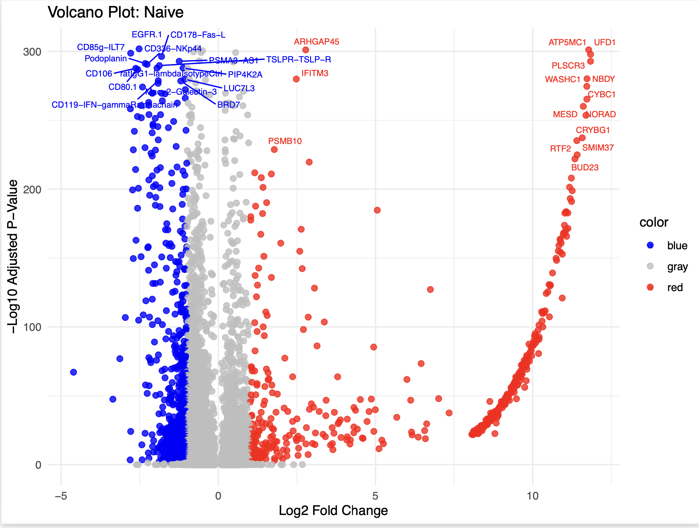


### Volcano Plots For Memory CD4 Cells


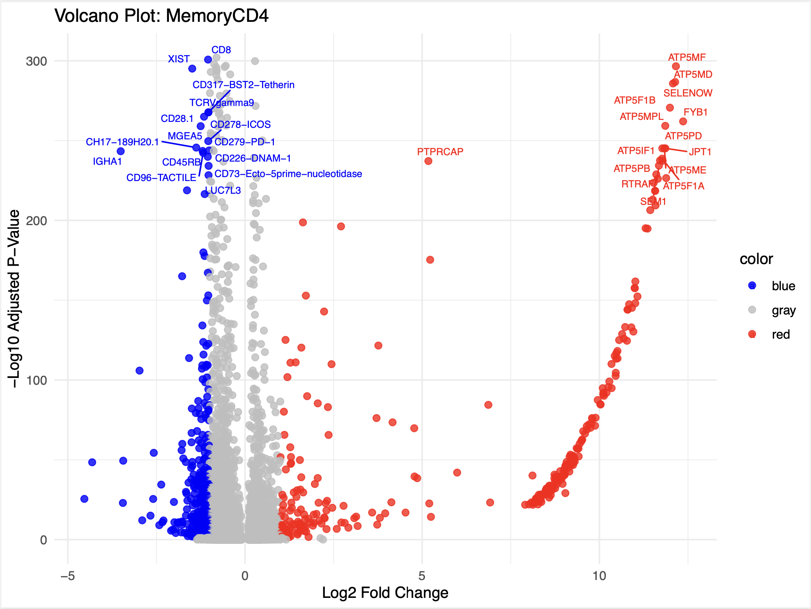

### Volcano Plots For CD8 T Cells


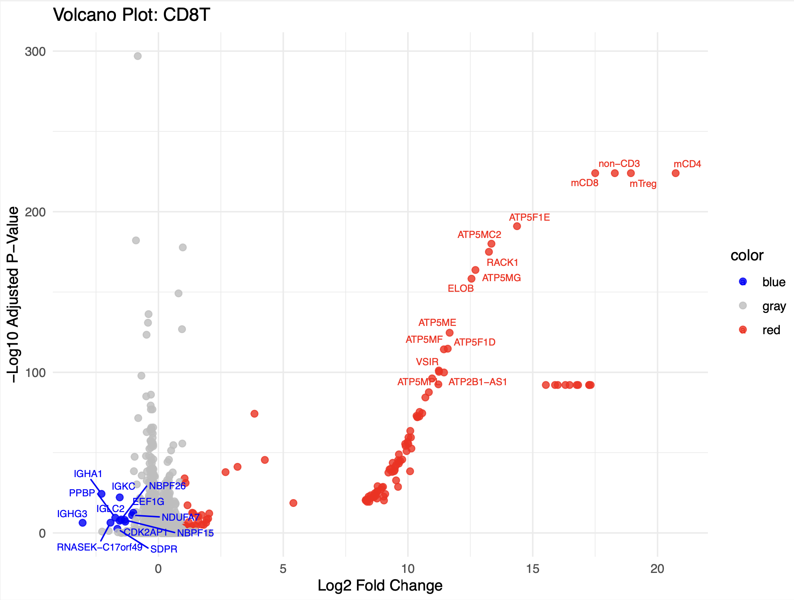


### Volcano Plots For FCGR3AMonocyte Cells


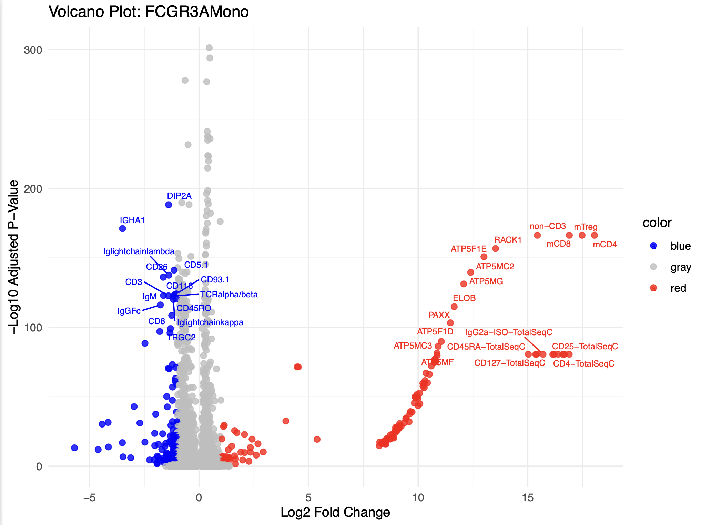


### Volcano Plots For CD14Monocyte Cells

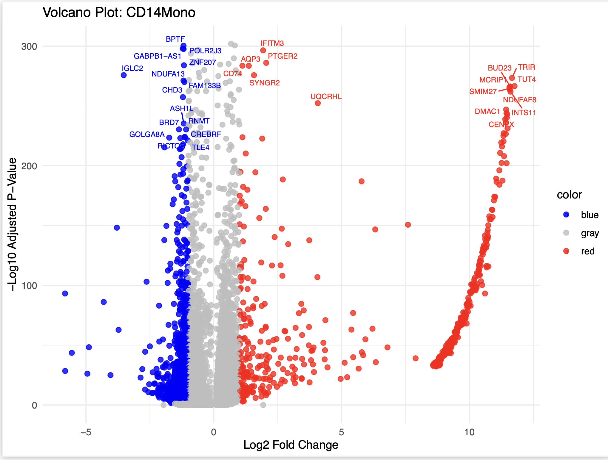

### Volcano Plots For Healthy vs Control All Cells

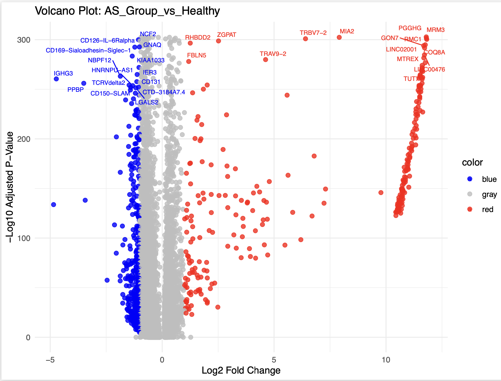


## Gene Lists

### Gene Lists For Memory CD4 Cells

#### Upregulated

```{r}
data <- read.csv("Gene_Lists/CD4_Gene_Lists/Upregulated/CD4_upregulated.csv")
knitr::kable(head(data, 10))
```
[Download CSV](Gene_Lists/CD4_Gene_Lists/Upregulated/CD4_upregulated.csv)


#### Downregulated

```{r}
data <- read.csv("Gene_Lists/CD4_Gene_Lists/Downregulated/CD4_downregulated.csv")
knitr::kable(head(data, 10))
```
[Download CSV](Gene_Lists/CD4_Gene_Lists/Downregulated/CD4_downregulated.csv)

### Gene Lists For CD8 T Cells

#### Upregulated

```{r}
data <- read.csv("Gene_Lists/CD8_Gene_Lists/Upregulated/CD8_upregulated.csv")
knitr::kable(head(data, 10))
```
[Download CSV](Gene_Lists/CD8_Gene_Lists/Upregulated/CD8_upregulated.csv)


#### Downregulated

```{r}
data <- read.csv("Gene_Lists/CD8_Gene_Lists/Downregulated/CD8_downregulated.csv")
knitr::kable(head(data, 10))
```
[Download CSV](Gene_Lists/CD8_Gene_Lists/Downregulated/CD8_downregulated.csv)

### Gene Lists For Naive Cells

#### Upregulated

```{r}
data <- read.csv("Gene_Lists/Naive_Gene_Lists/Upregulated/Naive_upregulated.csv")
knitr::kable(head(data, 10))
```
[Download CSV](Gene_Lists/Naive_Gene_Lists/Upregulated/Naive_upregulated.csv)


#### Downregulated

```{r}
data <- read.csv("Gene_Lists/Naive_Gene_Lists/Downregulated/Naive_downregulated.csv")
knitr::kable(head(data, 10))
```
[Download CSV](Gene_Lists/Naive_Gene_Lists/Downregulated/Naive_downregulated.csv)

### Gene Lists For CD14Mono Cells

#### Upregulated

```{r}
data <- read.csv("Gene_Lists/CD14Mono/Upregulated/CD14_Mono_upregulated.csv")
knitr::kable(head(data, 10))
```
[Download CSV](Gene_Lists/CD14Mono_Gene_Lists/Upregulated/CD14Mono_upregulated.csv)


#### Downregulated

```{r}
data <- read.csv("Gene_Lists/CD14Mono/Downregulated/CD14_Mono_downregulated.csv")
knitr::kable(head(data, 10))
```
[Download CSV](Gene_Lists/CD14Mono_Gene_Lists/Downregulated/CD14Mono_downregulated.csv)


### Gene Lists For FCGR3AMono Cells

#### Upregulated

```{r}
data <- read.csv("Gene_Lists/FCGR3AMono_Gene_Lists/Upregulated/FCGR3AMono_upregulated.csv")
knitr::kable(head(data, 10))
```
[Download CSV](Gene_Lists/FCGR3AMono_Gene_Lists/Upregulated/FCGR3AMono_upregulated.csv)


#### Downregulated

```{r}
data <- read.csv("Gene_Lists/FCGR3AMono_Gene_Lists/Downregulated/FCGR3AMono_downregulated.csv")
knitr::kable(head(data, 10))
```
[Download CSV](Gene_Lists/FCGR3AMono_Gene_Lists/Downregulated/FCGR3AMono_downregulated.csv)

### Gene Lists For AS_VS_Healthy Cells

#### Upregulated

```{r}
data <- read.csv("Gene_Lists/AS_VS_Healthy_Gene_Lists/Upregulated/AS_VS_Healthy_upregulated.csv")
knitr::kable(head(data, 10))
```
[Download CSV](Gene_Lists/AS_VS_Healthy_Gene_Lists/Upregulated/AS_VS_Healthy_upregulated.csv)


#### Downregulated

```{r}
data <- read.csv("Gene_Lists/AS_VS_Healthy_Gene_Lists/Downregulated/AS_VS_Healthy_downregulated.csv")
knitr::kable(head(data, 10))
```
[Download CSV](Gene_Lists/AS_VS_Healthy_Gene_Lists/Downregulated/AS_VS_Healthy_downregulated.csv)


## Enrichr Results

### Pathways

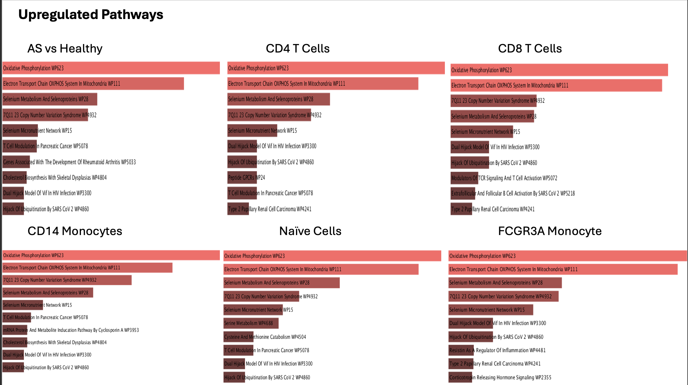


### Ontologies

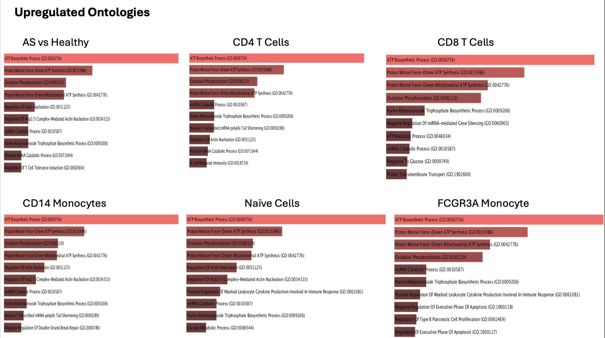

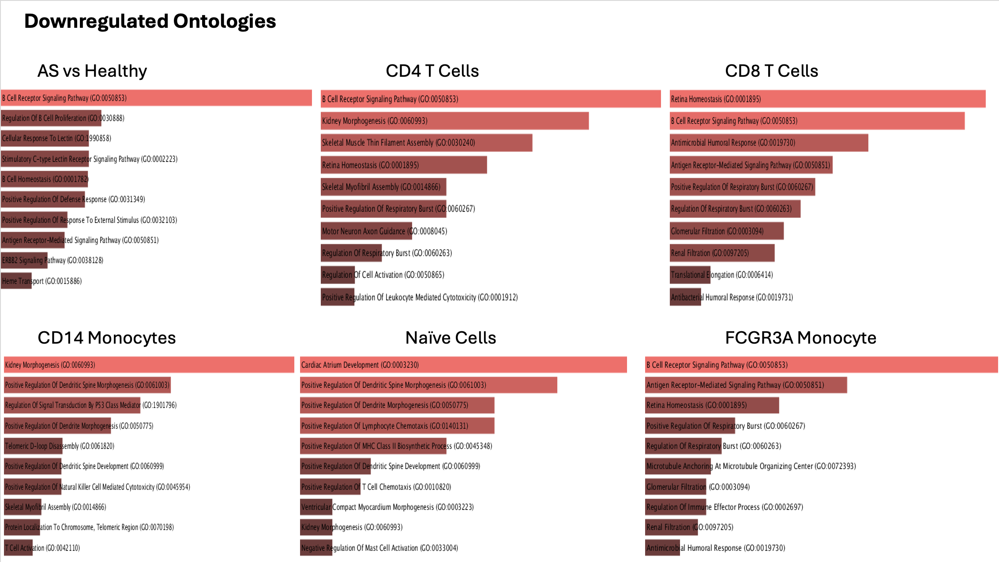


# Summary and Next Steps
This project successfully integrated scRNAseq data from AS samples and healthy controls from multiple sources. The fastq files were mapped using starSolo and generated count matrix, barcode, and gene list files. All samples had these three files, which were used to create a Seurat object for each sample, which were merged into one large object. The combined Seurat object was batch corrected with Harmony and the diseased samples were grouped under one label. This cleaned object was used to create UMAPs to better understand the structure of the data and identify which clusters represent the cell types of interest. A DESeq2 pipeline was implemented to analyze the differential gene expression between healthy and diseased samples in both all cells as well as specific cell subsets.

However, the DESeq2 results do not reflect the expression that was expected. With low cell counts and extremely low gene expression, the subsetted cell type data was very sparse and difficult to interpret. The comparison with all cell types included showed several genes up-regulated in the diseased group related to metabolism, supporting the hypothesis that AS is driven my metabolic processes. 

To correct the subsetted cell type data, I have filtered out any genes with zero counts, confirmed that the adjusted p-values are being calculated correctly, namely with the Benjamini-Hochberg procedure, and I have tried running a Wilcoxon rank sum test in place of DESeq2. I have also tried running a pipeline without pseudobulking in order to preserve cell counts, as the subsetted groups had low cell counts (less than 150). While these efforts did not create the results we were looking for, there are several other possibilities for this sparsity. In the following week, I will investigate the following:

1. Confirm that pseudobulking is based on average cells per sample per cell type to maximize statistical power.
2. Ensure that the sample size is sufficient for both healthy and AS groups. 
3. Ensure DESeq2 handles raw counts
4. Re-run Wilxon rank sum test, ensuring the data is a log-normalized matrix.
5. Re-evaluate my DESeq2 model and include donor-level correction.
6. Run Enrichr pathway analysis on new results

These steps will confirm that the pipeline is correctly implemented so that we can have confidence in the data and can determine whether an alternative approach is needed.  

# Feb/25 Update:
I was able to correct the cell-level comparisons by implementing the Wilcoxon rand sum test instead of DESeq2. The main issue was, after pseudobulking the data and subsetting the Idents (clusters) for each cell type, DESeq2 could not handle the sparse matrices. Since DESeq2 uses a negative binomial model to estimate the variability across replicates (samples) and includes zeroes, this can lead to strange p-values if there are a lot of zeroes in the data. To resolve this, I removed the pseudobulking and switched to a Wilcoxon rank sum test, which compares the ranks of expression for nonzero values between groups (samples). A log normalized matrix of counts was the input for this test, as the Wilcoxon function does not automatically normalize the data like DESeq2 does. 

After pseudobulking was removed and the Wilcoxon rank sum test was implemented, I was able to generate volcano plots with significant genes. The next step is to investigate the up and down regulated genes and their pathways. I could also re-identify cell types by generating gene expression heatmaps and pulling clusters with specific genes of interest rather than relying on Seurat's built in FindMarkers cell type identification. In the following week I will work on the following:

1. Re-run pipeline to re-identify clusters
2. Investigate top genes and their pathways
3. Generate gene expression heatmaps for genes of interest


